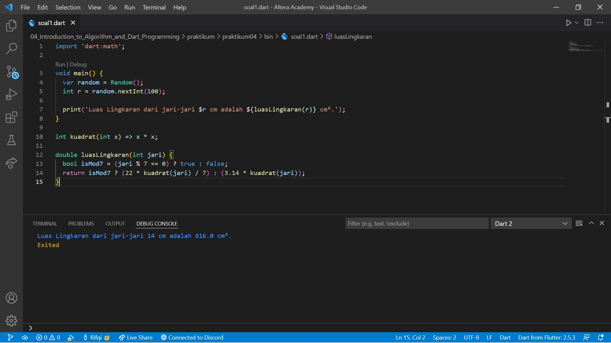
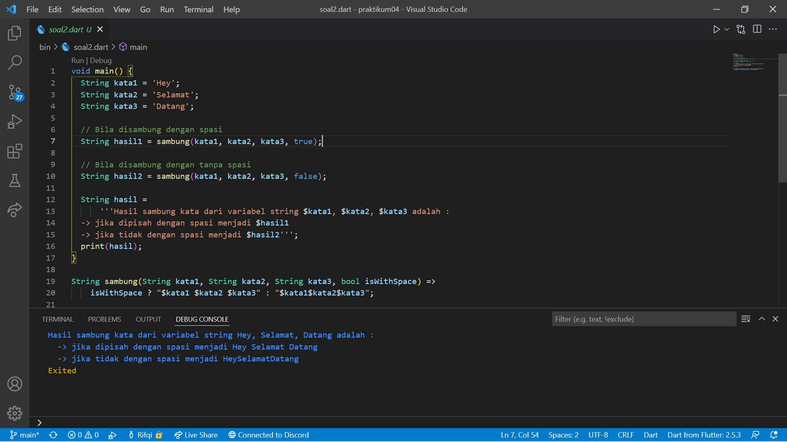

# 04. Introduction to Algorithm and Dart Programming

```
Name    : Rifqi Mufidianto 
Section : 04. Introduction to Algorithm and Dart Programming
Date    : Day 4
```

## Summary
Dalam materi ini, mempelajari tentang Introduction to Algorithm and Dart Programming, dan berikut beberapa ringkasan dari materi yang telah dipelajari.
- Dart merupakan bahasa pemrograman yang dirancang untuk membuat aplikasi agar dapat berjalan dengan cepat.
- Kenapa harus Dart?
    - Type safe -> konsistensi tipe data
    - Null safety -> keamanan data dari null
    - Rich standard library -> banyak dukungan library internal
    - Multiplatform -> berjalan dibeberapa platform
- Fungsi Main merupakan bagian yang dijalankan saat pertama kali. Dapat berupa void atau int.
- Variabel digunakan untuk menyimpan data yang memiliki nama dan tipe data.
- Konstanta sama seperti variabel namun nilainya tetap atau tidak dapat diubah.
- Jenis - jenis tipe data :
    - int -> `0`, `1`, `2`, `3`, `4`, `5`
    - double -> `10.5`, `65.3`, `234.567`
    - bool -> `true` atau `false`
    - string -> `teks`
- Operator digunakan untuk operasi pengolahan data, dana data yang dikelola tersebut disebut operand.
- Operator terdiri dari :
    - Arithmethic -> `+`, `-`, `*`, `/`, `%`
    - Assignment -> `=`, `+=`, `-=`, `*=`, `/=`, `%=`
    - Comparison -> `==`, `<`, `>`, `<=`, `>=`
    - Logical -> `&&`, `||`, `!`
- Fungsi adalah blok bangunan kode yang dapat dibaca, dipelihara, dan dapat digunakan kembali.
- Anonymous Function
    - Tidak memiliki nama
    - Fungsi sebagai data
    ```
    var jumlah = (int a, int b) {
        return a + b;
    }
    ```
- Arrow Function
    - Dapat memiliki nama atau tidak
    - Berisi 1 data (proses maupun data statis)
    - Return fungsi ini diambil dari data tersebut
    ```
    var jumlah = (int a, int b) => a + b;
    ```
- Async-await
    - Menjalankan beberapa proses tanpa perlu menunggu.
    - Proses ditulis dalam bentuk fungsi.
    - `await` akan menuggu hingga proses `async` selesai.
    ```
    Future<String> p1() async {
        await Future.delayed(Duration(seconds: 1), (){
            return 'hello dari p1';
        });
    }

    void p2() {
        print('hello dari p2');
    }

    void main() async {
        var data = await p1();

        print(data);
        p2();
    }

    output: 
    hello dari p1
    hello dari p2
    ```
- Collection -> Kumpulan data pada satu tempat
    - List -> Menyimpan data secara berbaris dan setiap data memiliki index.
        ```
        var numbers = [];
        numbers.add(1);
        numbers.add(2);
        numbers.add(3);
        print(numbers);

        output:
        [1, 2, 3]
        ```
    - Map -> Menyimpan data secara key-value. Key yang berguna selayaknya index pada list.
        ```
        var student = {};
        student['name'] = 'Fulan';
        student['age'] = 21;

        print(student);
        print(student['name']);
        print(student['age']);

        output:
        {name: Fulan, age: 21}
        Fulan
        21
        ```

## Task
Berikut hasil yang telah dicoba dan didapatkan pada materi ini.

### Tugas 1
Implementasikan rumus luas lingkaran pada program Dart!

[Source Code](./praktikum/praktikum04/bin/soal1.dart)



### Tugas 2
Buatlah 3 buah variabel yang berisi string, lalu sambungkan seluruh string  tersebut, dan tampilkan pada layar!

[Source Code](./praktikum/praktikum04/bin/soal2.dart)

