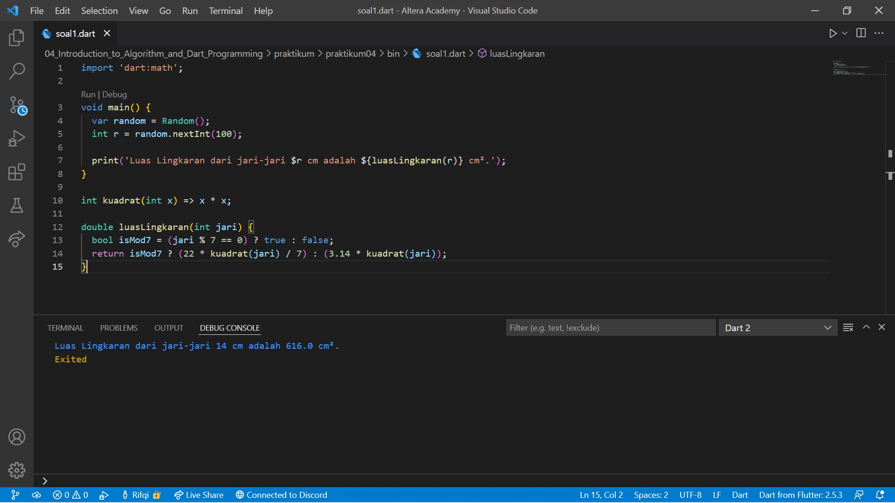
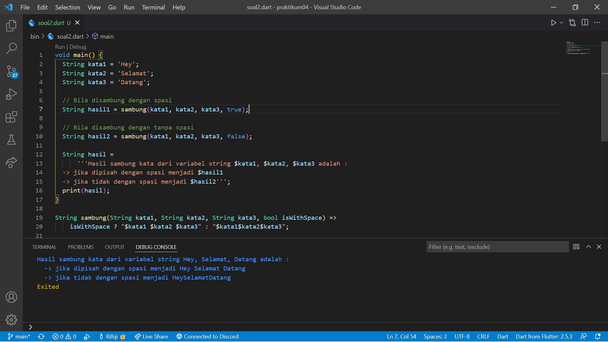

# 05. Basic Dart Programming (Branching)

```
Name    : Rifqi Mufidianto 
Section : 05. Basic Dart Programming (Branching)
Date    : Day 5
```

## Summary
### Branching
**IF**
- Memerlukan nilai boolean (bool) (dari operator logical atau comparison)
- Menjalankan bagian proses jika nilai bool bernilai true
```
var usia = 18;
if (usia < 20) {
    print('Remaja');
}
```
**IF-ELSE**
- Berjalan dengan `if`
- Menambah alternatif jika nilai boolean (bool) adalah false
```
var usia = 18;
if (usia < 20) {
    print('Remaja');
} else {
    print('tidak memiliki golongan');
}
```
atau menggunakan ternary operator (one line if-else)
```
var usia = 18;
usia < 20 ? print('Remaja'); : print('tidak memiliki golongan');
```
**ELSE-IF**
- Menambah alternatif jika nilai boolean (bool) adalah false
- Menambah pengujian nilai boolean (bool) lain
```
var usia = 18;
if (usia < 20) {
    print('Remaja');
} else if (usia < 40 ) {
    print('Dewasa');
} else {
    print('tidak memiliki golongan');
}
```
atau menggunakan ternary operator (one line if-else)
```
var usia = 18;
(usia < 20) ? print('Remaja'); : (usia < 40) ? print('Dewasa'); : print('tidak memiliki golongan');
```
### Fungsi
- Fungsi adalah blok bangunan kode yang dapat dibaca, dipelihara, dan dapat digunakan kembali.
- Anonymous Function
    - Tidak memiliki nama
    - Fungsi sebagai data
    ```
    var jumlah = (int a, int b) {
        return a + b;
    }
    ```
- Arrow Function
    - Dapat memiliki nama atau tidak
    - Berisi 1 data (proses maupun data statis)
    - Return fungsi ini diambil dari data tersebut
    ```
    var jumlah = (int a, int b) => a + b;
    ```
- Async-await
    - Menjalankan beberapa proses tanpa perlu menunggu.
    - Proses ditulis dalam bentuk fungsi.
    - `await` akan menuggu hingga proses `async` selesai.
    ```
    Future<String> p1() async {
        await Future.delayed(Duration(seconds: 1), (){
            return 'hello dari p1';
        });
    }

    void p2() {
        print('hello dari p2');
    }

    void main() async {
        var data = await p1();

        print(data);
        p2();
    }

    output: 
    hello dari p1
    hello dari p2
    ```

## Task
Berikut hasil yang telah dicoba dan didapatkan pada materi ini.

### Tugas 1
Implementasikan rumus luas lingkaran pada program Dart!

[Source Code](./praktikum/task_01.dart)



### Tugas 2
Buatlah 3 buah variabel yang berisi string, lalu sambungkan seluruh string  tersebut, dan tampilkan pada layar!

[Source Code](./praktikum/task_02.dart)

        