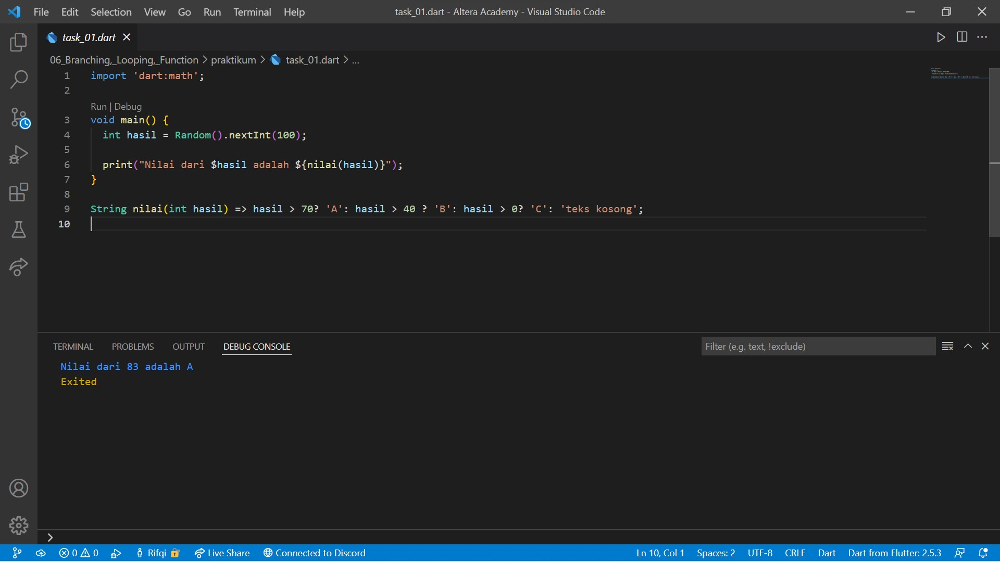
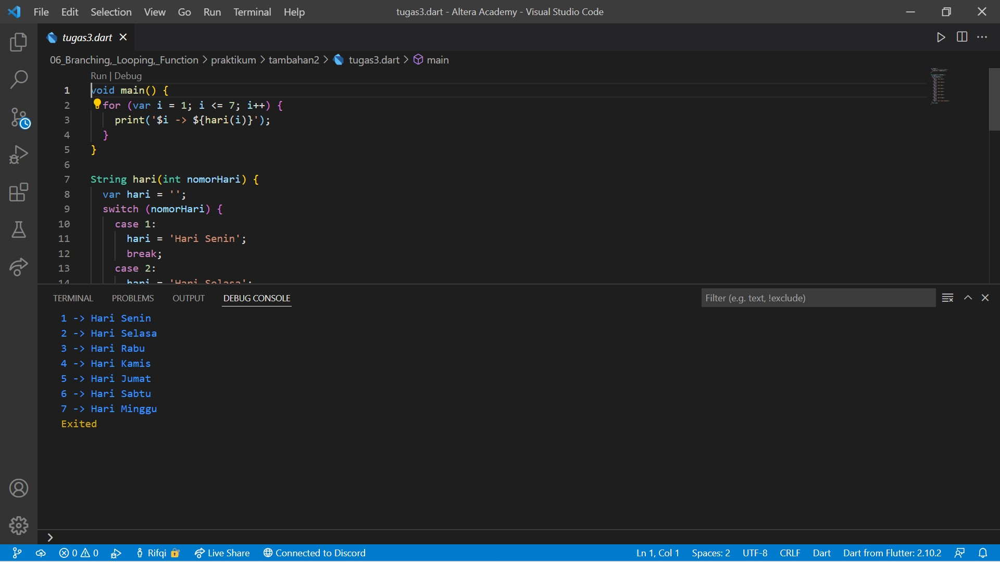

# 06. Branching, Looping, Function

```
Name    : Rifqi Mufidianto 
Section : 06. Branching, Looping, Function
Date    : Day 7 & 8
``` 

## Summary
### Branching
**IF**
- Memerlukan nilai boolean (bool) (dari operator logical atau comparison)
- Menjalankan bagian proses jika nilai bool bernilai true
```
var usia = 18;
if (usia < 20) {
    print('Remaja');
}
```
**IF-ELSE**
- Berjalan dengan `if`
- Menambah alternatif jika nilai boolean (bool) adalah false
```
var usia = 18;
if (usia < 20) {
    print('Remaja');
} else {
    print('tidak memiliki golongan');
}
```
atau menggunakan ternary operator (one line if-else)
```
var usia = 18;
usia < 20 ? print('Remaja'); : print('tidak memiliki golongan');
```
**ELSE-IF**
- Menambah alternatif jika nilai boolean (bool) adalah false
- Menambah pengujian nilai boolean (bool) lain
```
var usia = 18;
if (usia < 20) {
    print('Remaja');
} else if (usia < 40 ) {
    print('Dewasa');
} else {
    print('tidak memiliki golongan');
}
```
atau menggunakan ternary operator (one line if-else)
```
var usia = 18;
(usia < 20) ? print('Remaja'); : (usia < 40) ? print('Dewasa'); : print('tidak memiliki golongan');
```
### Perulangan
**For**
- Diketahui berapa kali perulangan terjadi
- Memerlukan nilai awal
- Memerlukan nilai boolean (bool), jika true maka perulangan dilanjutkan
- Memerlukan pengubah nilai
```
for(var i = 1; i <= 10; i++){
    print(i);
}
```
**While**
- Tidak diketahui berapa kali perulngan terjadi
- Memerlukan nilai boolean (bool), jika true maka perulangan dilanjutkan
```
var i = 1;
while(i <= 10) {
    print(i);
    i++;
}
```
**Do-While**
- Mengubah bentuk while
- Proses dijalankan minimum sekali, akan diteruskan jika nilai boolean (bool) adalah true
```
var i = 1;
do {
    print(i);
    i++;
} while(i <= 10);
```
### Break dan Continue
- Break dan continue dapat menghentikan perulangan dengan mengabaikan nilai boolean (bool)
- Continue dapat menghentikan satu kali proses
- Perbedaannya adalah `break` menghentikan seluruh proses perulangan, sedangkan `continue` menghentikan satu kali proses perulangan.

**Break**
```
for(var i = 1; i <= 10; i++){
    if (i == 6) {
        break; //jika i adalah 6 maka dihentikan
    }
    print(i);
}
```
**Continue**
```
for(var i = 1; i <= 10; i++){
    if (i == 6) {
        continue; //jika i adalah 6 maka dilewati
    }
    print(i);
}
```
### Fungsi
- Kumpulan perintah
- Dapat digunakan berkali-kali
- Cukup mengubah fungsi sekalim penggunaan lainnya akan ikut berubah
```
void main() {
    var hasil = jumlah(3,3);
    print(hasil);
}

// Arrow Function (fungsi dengan return)
int jumlah(int a, int b) => a + b;
```
## Task
Berikut hasil yang telah dicoba dan didapatkan pada materi ini.

### Tugas 1
[Source Code](./praktikum/task_01.dart)



### Tugas 2
[Source Code](./praktikum/task_02.dart)
- a. 10!
    

- b. 20!
    

- c. 30!
    

### Tugas Tambahan
Berikut merupakan tugas tambahan dari mentor mengenai branching, looping, and function.

**Tugas 1**
- [Tugas Tambahan 1](./praktikum/tambahan/tugas_01.dart)


**Tugas 2**
- [Tugas Tambahan 2](./praktikum/tambahan/tugas_02.dart)


**Tugas 3**
- [Tugas Tambahan 3](./praktikum/tambahan/tugas_03.dart)


**Tugas 4**
- [Tugas Tambahan 4](./praktikum/tambahan/tugas_04.dart)


**Tugas 5**
- [Tugas Tambahan 5](./praktikum/tambahan/tugas_05.dart)


### Tugas Tambahan 2
Berikut merupakan tugas tambahan dari mentor mengenai branching.

**Tugas 1**
- [Tugas Tambahan 1](./praktikum/tambahan2/tugas1.dart)


**Tugas 2**
- [Tugas Tambahan 2](./praktikum/tambahan2/tugas2.dart)


**Tugas 3**
- [Tugas Tambahan 3](./praktikum/tambahan2/tugas3.dart)



**Tugas 4**
- [Tugas Tambahan 4](./praktikum/tambahan2/tugas4.dart)

