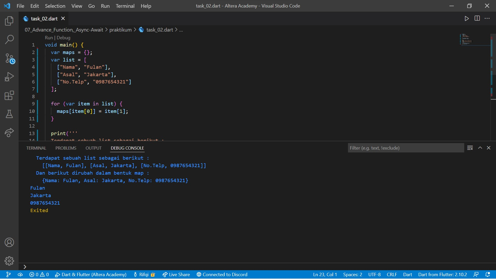

# 07. Advance Function, Async-Await

```
Name    : Rifqi Mufidianto 
Section : 07. Advance Function, Async-Await
Date    : Day 9 & 10
``` 

## Summary
- Fungsi adalah blok bangunan kode yang dapat dibaca, dipelihara, dan dapat digunakan kembali.
- Anonymous Function
    - Tidak memiliki nama
    - Fungsi sebagai data
    ```
    var jumlah = (int a, int b) {
        return a + b;
    }
    ```
- Arrow Function
    - Dapat memiliki nama atau tidak
    - Berisi 1 data (proses maupun data statis)
    - Return fungsi ini diambil dari data tersebut
    ```
    var jumlah = (int a, int b) => a + b;
    ```
- Async-await
    - Synchronous dalam pemrograman adalah sekumpulan statement kode yang dieksekusi secara berurutan. Dengan kata lain, tiap baris statement akan dieksekusi setelah statement sebelumnya sudah selesai dieksekusi.
    - Asynchronous, sebaliknya, mengijinkan kita untuk menjalankan statement kode di thread lain di luar thread utama. Sehingga, ketika program mengeksekusi hal-hal berat di thread lain, user tetap dapat menjalankan proses lain di thread utama.
    - Menjalankan beberapa proses tanpa perlu menunggu.
    - Proses ditulis dalam bentuk fungsi.
    - `await` akan menuggu hingga proses `async` selesai.
    ```
    Future<String> p1() async {
        await Future.delayed(Duration(seconds: 1), (){
            return 'hello dari p1';
        });
    }

    void p2() {
        print('hello dari p2');
    }

    void main() async {
        var data = await p1();

        print(data);
        p2();
    }

    output: 
    hello dari p1
    hello dari p2
    ```

## Task
Berikut hasil yang telah dicoba dan didapatkan pada materi ini.

### Tugas 1
[Source Code](./praktikum/task_01.dart)


### Tugas 2
[Source Code](./praktikum/task_02.dart)

