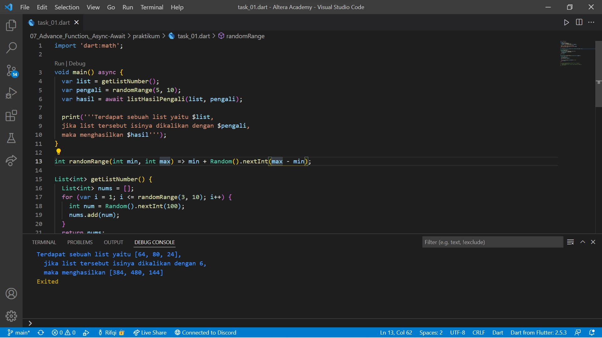
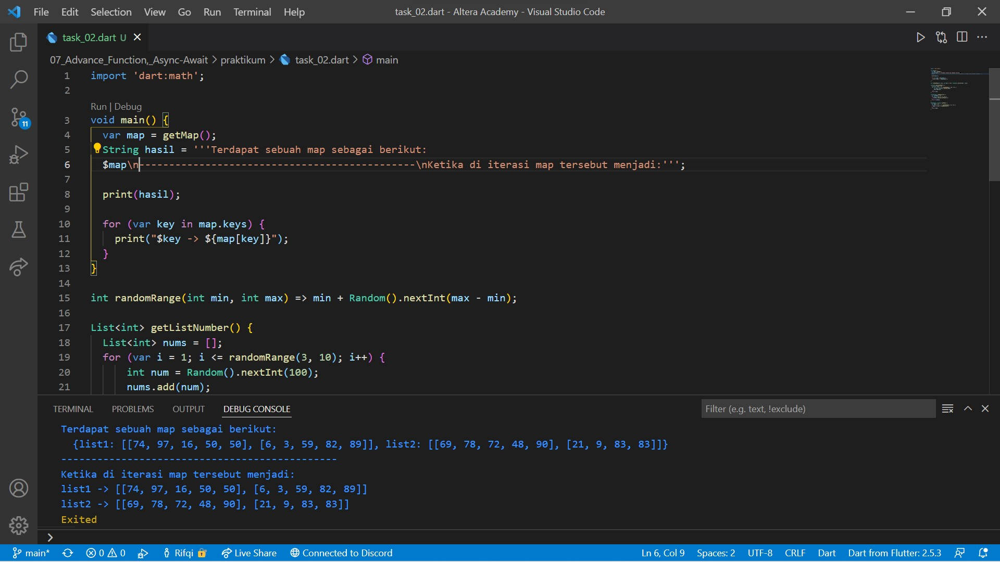

# 08. Collection

```
Name    : Rifqi Mufidianto 
Section : 08. Collection
Date    : Day 11
``` 

## Summary
- Collection -> Kumpulan data pada satu tempat
    - List -> Menyimpan data secara berbaris dan setiap data memiliki index.
        ```
        var numbers = [];
        numbers.add(1);
        numbers.add(2);
        numbers.add(3);
        print(numbers);

        output:
        [1, 2, 3]
        ```
    - Map -> Menyimpan data secara key-value. Key yang berguna selayaknya index pada list.
        ```
        var student = {};
        student['name'] = 'Fulan';
        student['age'] = 21;

        print(student);
        print(student['name']);
        print(student['age']);

        output:
        {name: Fulan, age: 21}
        Fulan
        21
        ```

## Task
Berikut hasil yang telah dicoba dan didapatkan pada materi ini.

### Tugas 1
[Source Code](./praktikum/task_01.dart)



### Tugas 2
[Source Code](./praktikum/task_02.dart)

