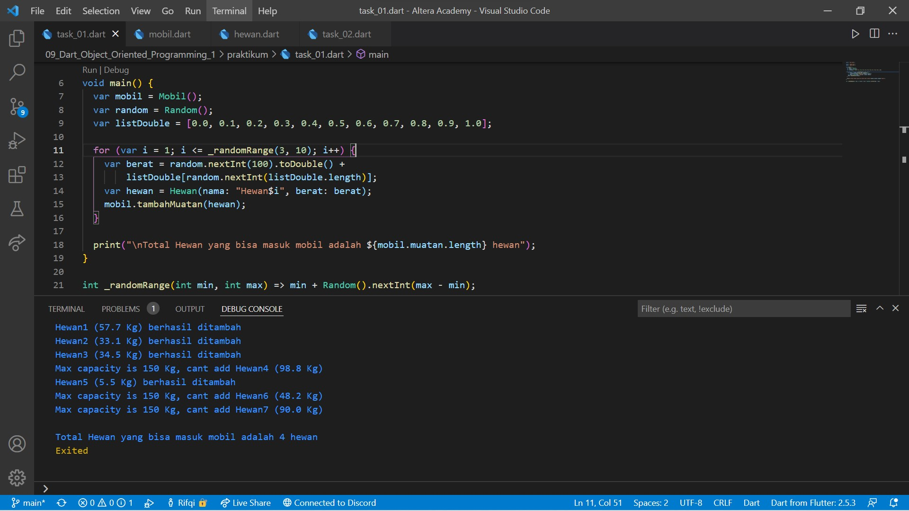
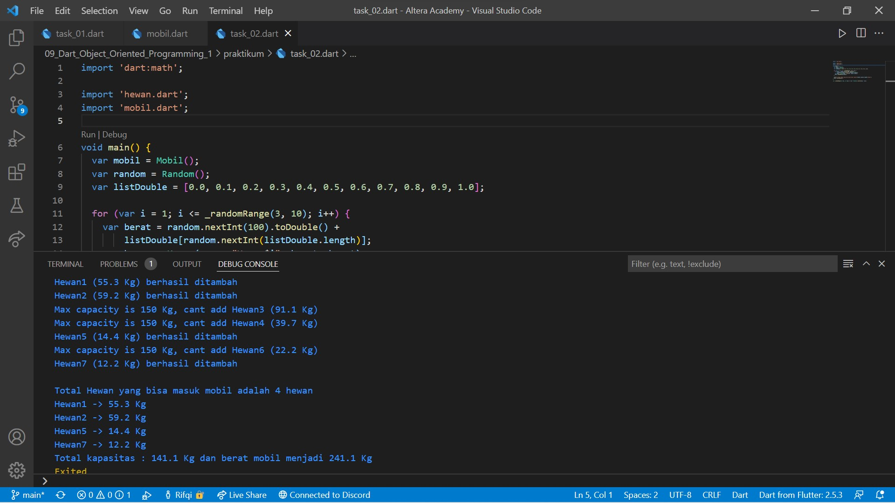

# 09. Dart Object Oriented Programming 1

```
Name    : Rifqi Mufidianto 
Section : 09. Dart Object Oriented Programming 1
Date    : Day 12
``` 

## Summary
### Object Oriented Programming (OOP)
- Program yang disusun dalam bentuk abstraksi object
- Data dan proses diletakkan pada abstraksi tersebut
- Keuntungan dari Object Oriented Programming (OOP) :
    - Mudah di troubleshoot ketika terdapat masalah
    - Mudah digunakan kembali atau digunakan ulang
- Penggunaan OOP tidak hanya di dart melainkan di `C++`, `Java`, `Javascript`, `Python`, dll.
- OOP memiliki beberapa bagian kompenen diantaranya :
    - Class
    - Object
    - Property
    - Method
    - Inheritance
    - Generics

### Class
- Merupakan abstraksi dari sebuah benda (object)
- Memiliki ciri-ciri yang disebut property
- Memiliki sifat dan kemampuan yang disebut method
- Untuk membuat **Class**, dengan cara :
    - Menggunakan kata kunci `class`
    - Memiliki nama
    - Detail class diletakkan dalam kurawal (`{}`)
    ```
    class Hewan {

    }
    ```
- Untuk membuat sebuah object :
    - Bentuk sebenarnya dari class
    - Disebut juga `instance of class`
    - Diperlakukan seperti data
    ```
    void main() {
        var hewan = Hewan();
    }
    ```
### Property
- Ciri-ciri suatu class
- Hal-hal yang dimiliki suatu class
- Memiliki sifat seperti variabel
- Membuat Property (seperti variabel tetapi dalam sebuah class)
    ```
    class Hewan {
        var mata = 0;
        var kaki = 0;
    }
    ```        
- Mengakses Property (seperti variabel tetapi dalam sebuah object)
    ```
    void main() {
        var hewan = Hewan();
        print(hewan.kaki);
    }
    ```
### Method
- Sifat suatu class
- Aktivitas yang dapat dikerjakan suatu class
- Memiliki sifat seperti fungsi
- Membuat Method (seperti fungsi tetapi dalam sebuah class)
    ```
    class Hewan {
        void makan() {
            print('Hewan sedang makan');
        }
    }
    ```
- Menjalankan Method (seperti fungsi tetapi dalam sebuah object)
    ```
    void main() {
        var hewan = Hewan();
        hewan.makan();
    }
    ```

## Task
Berikut hasil yang telah dicoba dan didapatkan pada materi ini.

### List Source Code
- [All Source Code](./praktikum/)
- [Hewan](./praktikum/hewan.dart)
- [Mobil](./praktikum/mobil.dart)
- [Tugas 1](./praktikum/task_01.dart)
- [Tugas 2](./praktikum/task_02.dart)

### Tugas 1
[Source Code](./praktikum/task_01.dart)



### Tugas 2
[Source Code](./praktikum/task_02.dart)

