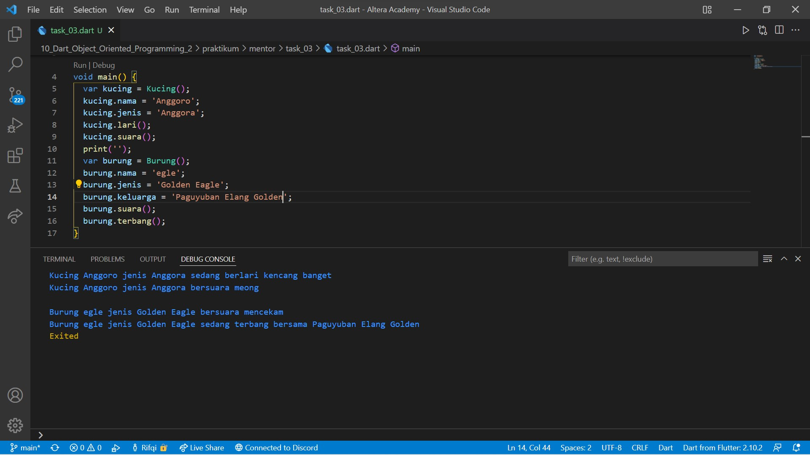

# 10. Dart Object Oriented Programming 2

```
Name    : Rifqi Mufidianto 
Section : 10. Dart Object Oriented Programming 2
Date    : Day 13 - 17
``` 

## Summary
Lanjutan dari [Object Oriented Programming (OOP).](/09_Dart_Object_Oriented_Programming_1/summary.md)

### Constructor
- Method yang dijalankan saat pembuatan object
- Dapat menerima parameter
- Tidak memiliki return
- Nama sama dengan nama class
```
Class Hewan {
    var mata;
    var kaki;

    Hewan() {
        mata = 0;
        kaki = 0;
    }
}
```

### Inheritance
- Bertujuan agar kemampuan class yang sudah ada dapat dimiliki oleh class baru
- Membuat class baru dengan memanfaatkan class yang sudah ada
- Untuk melakukan inheritance dapat dilakukan dengan menambah `extends` saat pembuatan class baru
```
class Kucing extends Hewan {
    Kucing() {
        mata = 2;
        kaki = 4;
    }
}
```
- Untuk penggunaannya sama seperti pembuatan object pada umumnya.

### Method Overriding
- Bertujuan agar class memiliki method yang sama, dengan proses yang berbeda
- Dengan cara menulis ulang method yang ada pada super-class
- untuk melakukan Overriding dapat dilakukan dengan cara:
    - Dilakukan pada class yang melakukan inheritance
    - Method sudah ada pada class induk
    - Method ditulis ulang seperti membuat method baru pada class anak
    - Ditambahkan tanda `@override` di baris sebelum membuat method dibuat
    ```
    class Kucing extends Hewan {
        @override
        bernafas() {
            print('Bernafas menggunakan paru-paru');
        }
    }
    ```
- Untuk penggunaannya sama seperti pembuatan object pada umumnya.

### Interface
- Berupa sebuah class
- Yang menunjukkan method apa saja yang ada pada suatu class
- Seluruh method wajib di-override
- Digunakan dengan menggunakan implements
- Untuk menggunakan interface pada class yang melakukan implements wajib melakukan override semu method yang ada pada class induk
- Untuk penggunaannya sama seperti pembuatan object pada umumnya.

### Abstract Class
- Berupa class abstrak
- Menunjukkan method apa saja yang ada pada suatu class
- Digunakan dengan menggunakan extends
- Tidak dapat dibuat object
- Tidak semua method harus di-override
```
abstract class Hewan {
    void bernapas() {
        print('tidak diketahui');
    }
}
```
- Untuk penggunaannya sama seperti pembuatan object pada umumnya.

### Polymorphism
- Kemampuan data berubah menjadi bentuk lain
- Tipe data yang dapat digunakan adalah super class
- Dapat dilakukan pada class dengan extends atau implements
- Untuk melakukan polymorphism, object dari class kucing dengan tipe data class Hewan.

### Generics
- Dapat digunakan pada class atau fungsi
- Memberi kemampuan agar dapat menerima data dengan tipe yang berbeda
- Tipe data yang diinginkan, ditentukan saat membuat class atau menjalankan fungsi
- Untuk membuat class dengan Generics, sebuah class dapat dimasukkan data dengan tipe `T`, dan tipe T dapat digunakan di seluruh class
```
class Hadiah<T> {
    var isi;
    
    Hadiah(T i) {
        isi = i;
    }
}
```
- Untuk menggunakan class dengan Generics, setelah nama class, menjadi tempat tipe data yang diinginkan
```
var hadiah1 = Hadiah<String>('mobil)
print(hadiah1.isi);
```
- Untuk membuat fungsi dengan Generics, setelah nama fungsi, menjadi tempat variabel generics
```
void cektipe<T>(T data){
    print(data.runtimeType);
}
```
- Untuk menggunakan fungsi dengan Generics, seteleah nama fungsi, menjadi tempat tipe data yang diinginkan
```
cekTipe<String>('contoh string');
```
## Task
Berikut hasil yang telah dicoba dan didapatkan pada materi ini.

### List Source Code
- [All Source Code](./praktikum/)
- [Bangun Ruang](./praktikum/task_01/bangun_ruang.dart) (Tugas 1)
- [Balok](./praktikum/task_01/balok.dart) (Tugas 1)
- [Kubus](./praktikum/task_01/kubus.dart) (Tugas 1)
- [Tugas 1](./praktikum/task_01/task_01.dart)
- [Matematika](./praktikum/task_02/matematika.dart) (Tugas 2)
- [FPB](./praktikum/task_02/faktor_persekutuan_terbesar.dart) (Tugas 2)
- [KPK](./praktikum/task_02/kelipatan_persekutuan_terkecil.dart) (Tugas 2)
- [Tugas 2](./praktikum/task_02/task_02.dart)

### Tugas 1
- [Bangun Ruang](./praktikum/task_01/bangun_ruang.dart)
- [Balok](./praktikum/task_01/balok.dart)
- [Kubus](./praktikum/task_01/kubus.dart)
- [Tugas 1](./praktikum/task_01/task_01.dart)


### Tugas 2
- [Matematika](./praktikum/task_02/matematika.dart)
- [FPB](./praktikum/task_02/faktor_persekutuan_terbesar.dart)
- [KPK](./praktikum/task_02/kelipatan_persekutuan_terkecil.dart)
- [Tugas 2](./praktikum/task_02/task_02.dart)


## Task (Mentor)
### Tugas 1
- [Pistol](./praktikum/mentor/task_01/pistol.dart)
- [Tugas 1](./praktikum/mentor/task_01/task_01.dart)


### Tugas 2
- [Mobil](./praktikum/mentor/task_02/mobil.dart)
- [Tugas 2](./praktikum/mentor/task_02/task_02.dart)


### Tugas 3
- [Hewan](./praktikum/mentor/task_03/hewan.dart)
- [Kucing](./praktikum/mentor/task_03/kucing.dart)
- [Unggas](./praktikum/mentor/task_03/unggas.dart)
- [Burung](./praktikum/mentor/task_03/burung.dart)
- [Tugas 3](./praktikum/mentor/task_03/task_03.dart)


