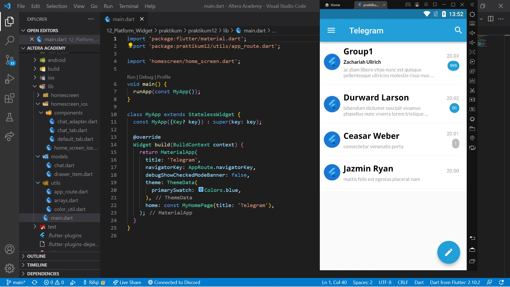
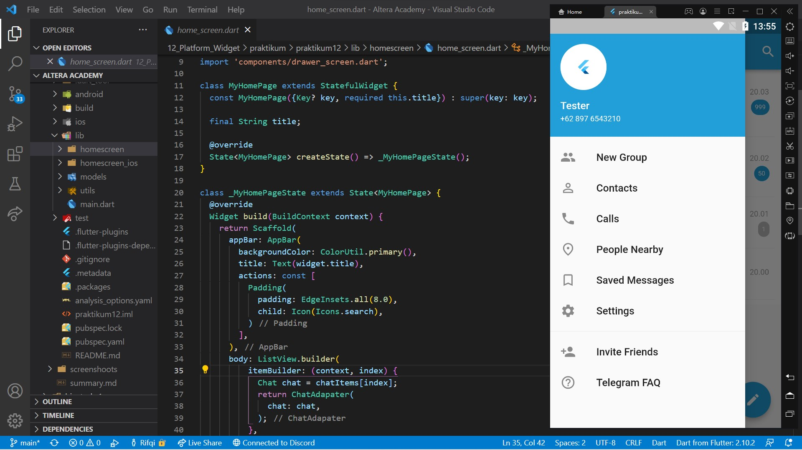
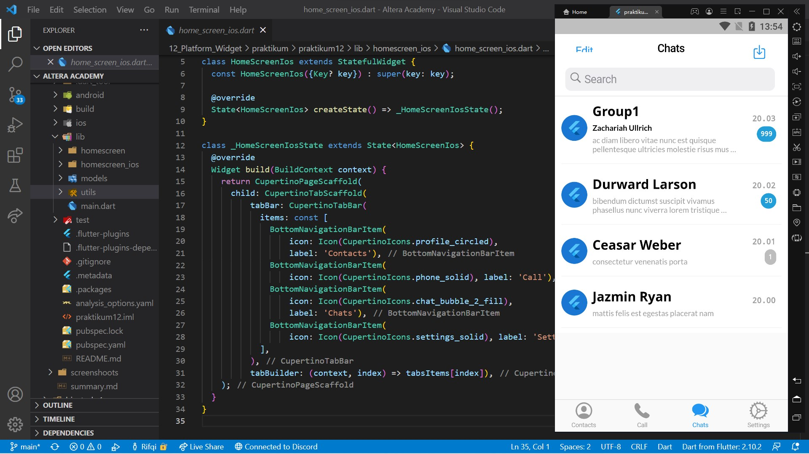

# 12. Platform Widget

```
Name    : Rifqi Mufidianto 
Section : 12. Platform Widget
Date    : Day 19 - 20
``` 

## Summary
Memanfaatkan widget dengan gaya berbeda pada Android & iOS.
### MaterialApp
- Widget dasar yang mengemas seluruh widget dalam aplikasi
- Widget yang digunakan pada sistem Android
- Di-import dari `package:flutter/material.dart`
- Struktur
    - Widget yang pertama kali dibuka, diletakkan pada bagian home.
    - Mengatur halaman juga dapat dilakukan dengan menggunakan `routes` dan `initialRoute`.

**Scaffold**
- Widget dasar untuk membangun sebuah halaman pada MaterialApp
- Dengan struktur untuk membentuk tata letak dasar sebuah halaman yang ditulis melalui properti-properti.

### CupertinoApp
- Widget dasar yang mengemas seluruh widget dalam aplikasi
- Widget yang digunakan pada sistem iOS
- Di-import dari `package:flutter/cupertino.dart`
- Struktur 
    - Variabel `_themeDark` dibuat untuk menyimpan tema
    - Diperlukan karena Cupertino **tidak menyediakan** `ThemeData.dark()` seperti pada Material
    - Widget yang pertama kali dibuka, diletakkan pada bagian home.

**CupertinoPageScaffold**
- Widget dasar untuk membangun sebuah halaman pada CupertinoApp
- Dengan struktur untuk membentuk tata letak dasar sebuah halaman yang ditulis melalui properti-properti.

## Task
Berikut hasil yang telah dicoba dan didapatkan pada materi ini.

[Project File](./praktikum/praktikum12/lib/)

[Folder Tugas 1](./praktikum/praktikum12/lib/homescreen/)

[Folder Tugas 2](./praktikum/praktikum12/lib/homescreen_ios/)

### Screenshoots

[Video Preview](https://drive.google.com/file/d/1bt-ao7xyI84nkrezCAgzgvcJFJj6RTl5/view?usp=sharing)





