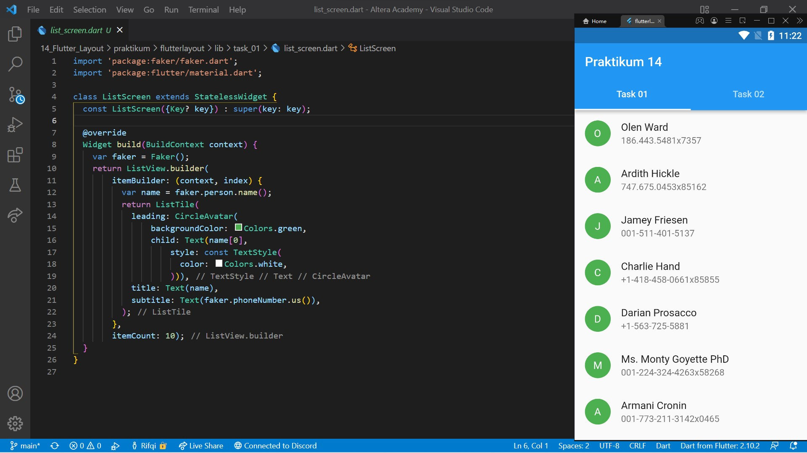
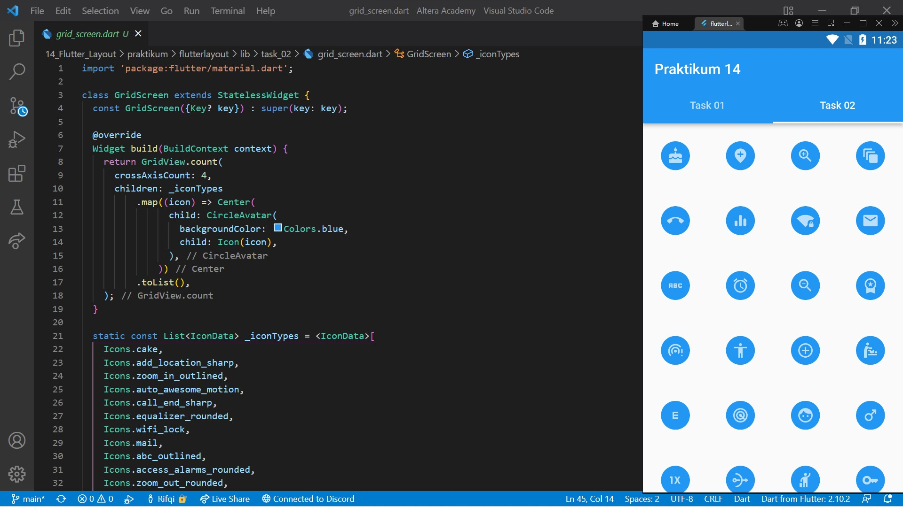

# 14. Flutter Layout

```
Name    : Rifqi Mufidianto 
Section : 14. Flutter Layout
Date    : Day 22 & 23
``` 

## Summary
### Apa itu Layout?
- Untuk mengatur tata letak
- Layout berbentuk widget yang mengatur widget di dalamnya

### Single-child Layout
- Container
    - Membuat sebuah box
    - Membuat widget lain
    - Box memiliki margin, padding, dan border
- Center
    - Membuat sebuah box
    - Membungkus widget lain
    - Memenuhi lebar dan tinggi ruang di luarnya  
    - Meletakkan widget berada dibagian tengah
- SizedBox
    - Membaut sebuah box
    - Membungkus widget lain
    - Box dapat diatur lebar dan tigginya
    - Lebih sederhana dari container 

### Multi-child Layout
- Column
    - Mengatur widget-widget secara vertikal
- Row
    - Mengatur widget-widget secara horizontal
- ListView
    - Mengatur widgets dalam bentuk list
    - Memiliki kemampuan scroll
- GridView
    - Mengatur widget-widget dalam bentuk galeri          


## Task
Berikut hasil yang telah dicoba dan didapatkan pada materi ini. Pada project ini digunakan library [Faker](https://pub.dev/packages/faker) untuk mengambil random nama dan no.telp.

[Project File](./praktikum/flutterlayout/lib/)

### Task 01
[Source Code](./praktikum/flutterlayout/lib/task_01/list_screen.dart)



### Task 02
[Source Code](./praktikum/flutterlayout/lib/task_02/grid_screen.dart)

