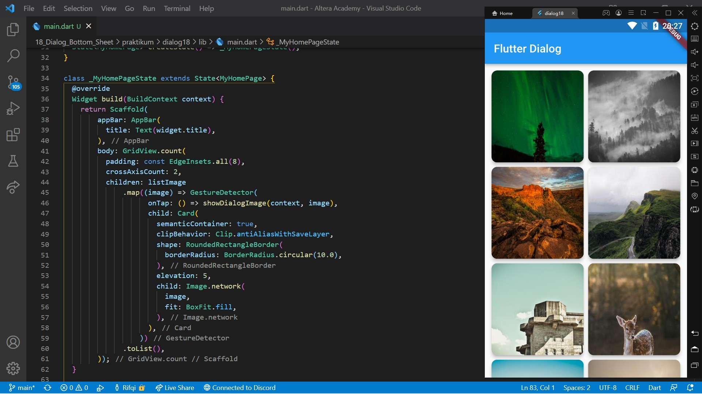
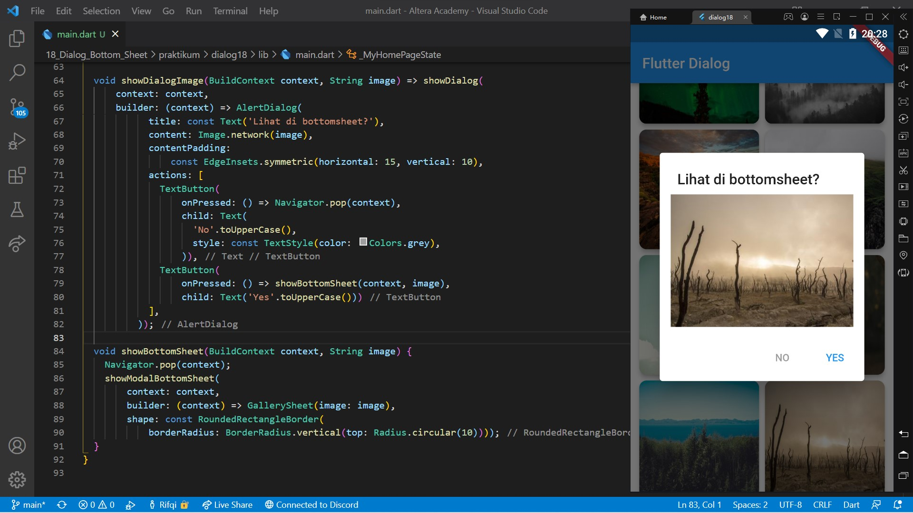
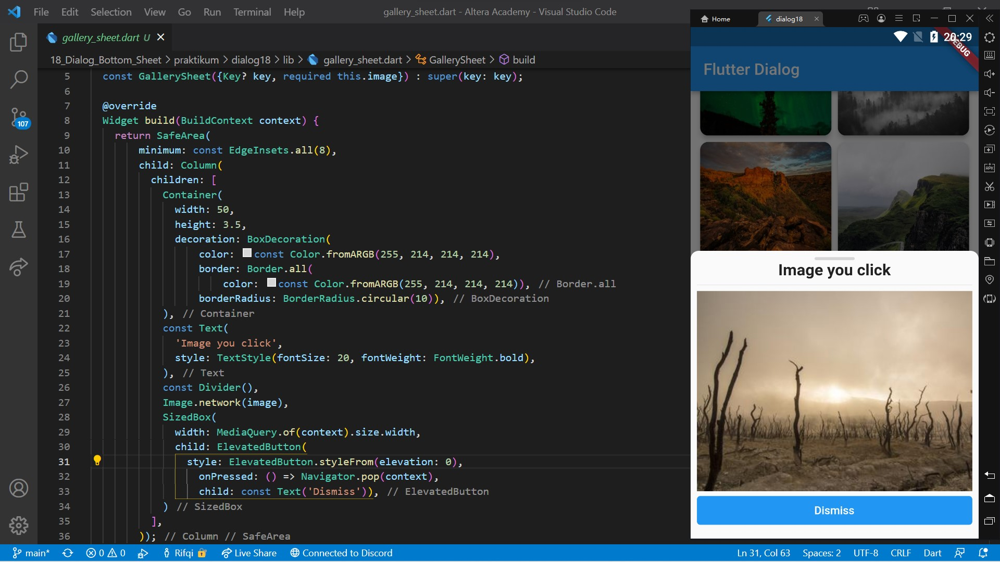

# 15. Dialog, Bottom Sheet

```
Name    : Rifqi Mufidianto 
Section : 15. Dialog, Bottom Sheet
Date    : Day 29
``` 

## Summary
### Aplikasi Task Management
- Berfungsi untuk menambahkan dan menghapus kegiatan
- Cara membuat aplikasi task management ([Full Source Code](https://drive.google.com/file/d/1iH20ZSmwmDA4gWYsC8sVZYcGL2S3IxXh/view))
    1. Membuat model untuk informasi yang mau disimpan. Buat folder `models` dan didalamnya buat file dart baru bernama *task_model.dart*
    2. Membuat Task Screen. Buat folder screens didalamnya buat file dart baru bernama *task_screen.dart*
    3. Membuat Empty Screen. Buat file dart baru bernama *empty_task_screen.dart* di folder screens 
    4. Tambahkan package [provider](https://pub.dev/packages/provider) di *pubspec.yaml*
    5. Membuat Task Manager. Buat file dart baru bernama *task_manager.dart* di dalam folder models. Tambahkan method deleteTask dan addTask
    6. Tambahkan TaskManager sebagai provider (*main.dart*)
    7. Membuat fungsi buildTaskScreen.Yang nantinya akan me-return antara Task Screen yang ada data nya atau yang kosong dan paggil fungsi nya di body (*task_screen.dart*)
    8. Membuat Task Item Screen. Buat file dart baru yang bernama *task_item_screen.dart* di dalam folder screens dan tambahkan properti onCreate
    9. Buat FAB untuk menavigasi ke *TaskItemScreen* (*task_screen.dart*)
    10. Menambahkan state properti, initState, dan dispose (task_item_screen.dart)
    11. Membuat buildNameField dan panggil fungsi nya di dalam ListView (*task_item_screen.dart*)
    12. Membuat buildButton dan panggil fungsi nya di dalam ListView (*task_item_screen.dart*)
    13. Membuat Task Item Card. Buat folder baru bernama components lalu didalamnya buat file dart baru bernama *task_item_card.dart*
    14. Menambahkan callback handler di elevatedButton pada buildButton, dan menambahkan paclage [uuid](https://pub.dev/packages/uuid) (*task_item_screen.dart*)
    15. Membuat Task List Screen. Didalam folder screens buat file dart baru bernama task_list_screen.dart. Tambahkan di buildTaskScreen (task_screen.dart)
    16. Menambahkan properti yang dibutuhkan pada TaskItemCard untuk melihat task yang sudah dibuat
    17. Menambahkan AlertDialog (*task_item_card.dart*)
    18. Membuat properti onPressed (*task_item_card.dart*)
    19. Menambahkan fungsi onPressed pada TaskItemCard, pada body fungsinya tambahkan method *deleteTask*, *Navigator.pop(context)*, dan *ScaffoldMessenger*
    20. Membuat BottomSheet (*task_screen.dart*)
    21. Buat file dart baru profile_sheet.dart di dalam folder components dan buat konten-konten nya
    22. Mengganti Container pada builder showModalBottomSheet menjadi ProfileSheet() (*task_screen.dart*)

### AlertDialog
- Untuk tampilan android, dari material design
- Menginformasikan pengguna tentang situasi tertentu
- Bisa digunakan untuk mendapatkan input dari user
- Membuthkan helper method *showDialog*
- Memanggil fungsi showDialog di dalam fungsi onPressed pada IconButton
- showDialog membutuhkan context dan builder
- Pada buildernya akan me-return AlertDialog
- AlertDialog menyediakan properti seperti content dan actions
- Content bisa dimasukkan widget text, gambar, dan animasi gambar
- Actions bisa ditambahkan button untuk menerima respon dari user

### BottomSheet
- Seperti dialog tetapi muncul dari bawah layar aplikasi
- Menggunakan fungsi bawaan flutter *showModalBottomSheet*
- Membutuhkan dua properti, yaitu context dan builder

## Task
Berikut hasil yang telah dicoba dan didapatkan pada materi ini.

### Source Code

[Project File](./praktikum/dialog18/lib/)

[Source Code Task 1 & 2](./praktikum/dialog18/lib/main.dart)

[Source Code Task 3](./praktikum/dialog18/lib/gallery_sheet.dart)

### Screenshoots





