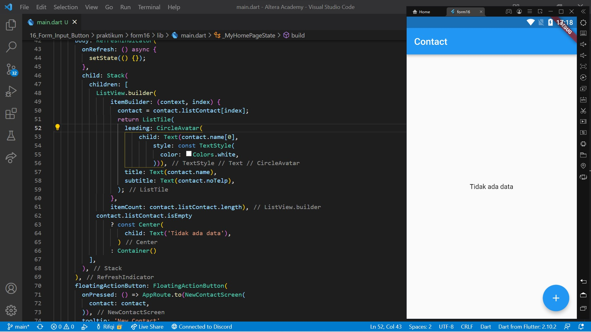
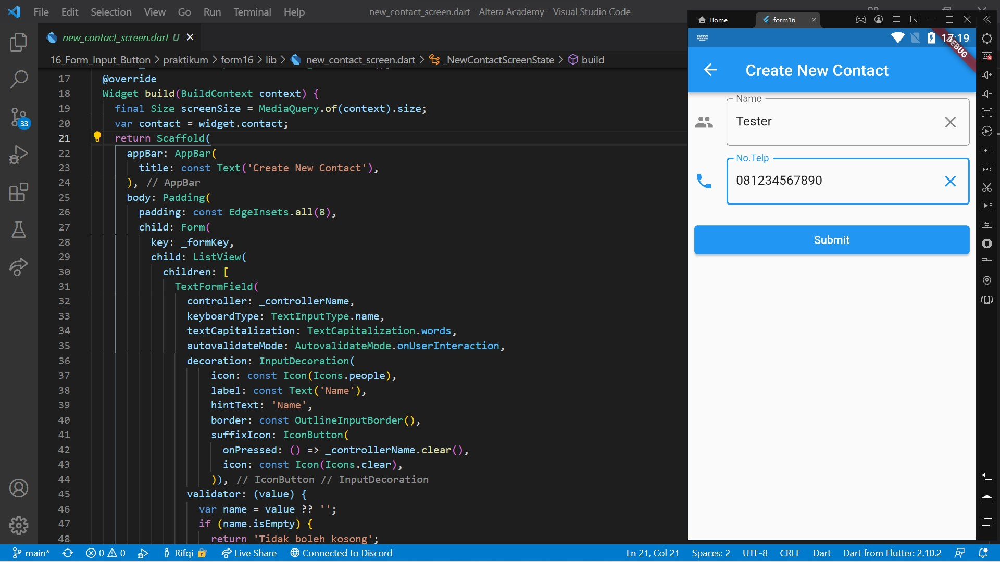
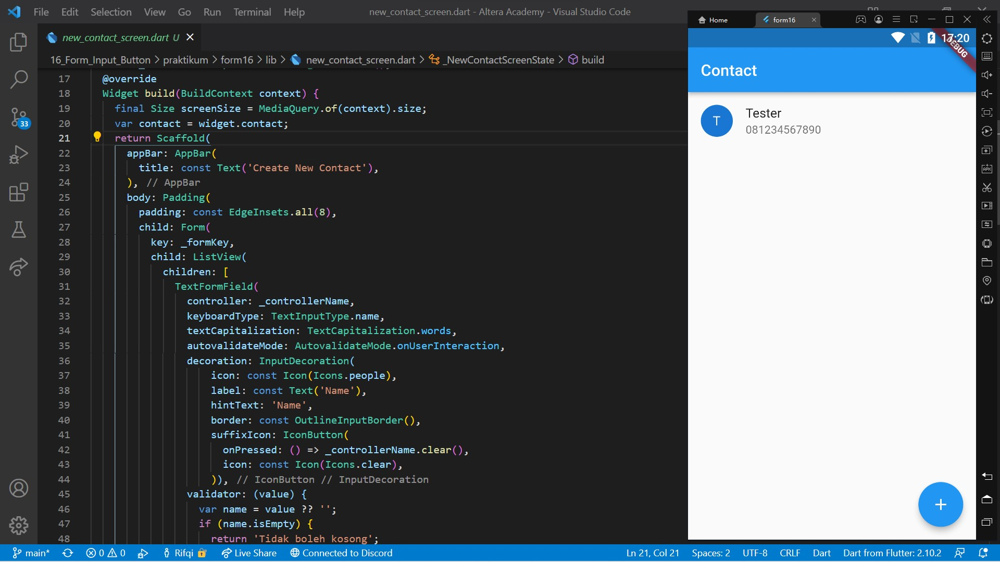
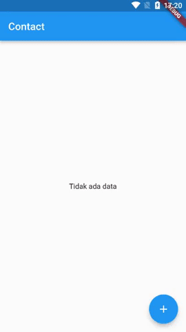

# 16. Form Input Button

```
Name    : Rifqi Mufidianto 
Section : 16. Form Input Button
Date    : Day 26-27
``` 

## Summary
### Form
- Menerima isian data dari pengguna
- Isian data dapat lebih dari satu
- Membuat form 
    - Menggunakan StatefulWidget
    - Keadaan form disimpan menggunakan GlobalKey<FormState>

### Input
**TextField**
- Menerima isian data dari pengguna
- Isian data dapat lebih dari satu
- Membuat TextField
    - Data diambil menggunakan TextEditingController
    - Isian data berupa teks

**Radio**
- Memberi opsi pada pengguna
- Hanya dapat memilih satu opsi
- Membuat Radio
    - Data diambil menggunakan property dengan tipe data sesuai valu pada radio

**Checkbox**
- Memberi opsi pada pengguna
- Dapat memilih beberapa opsi
- Membuat checkbox
    - Data diambil menggunakan property bertipe bool

**Dropdown Button**
- Memberi opsi pada pengguna
- Hanya dapat memilih satu opsi
- Opsi tidak ditampilkan di awal, hanya tampil jika ditekan
- Membuat DropdownButton
    - Data diambil menggunakan property dengan tipe data sesuai value pada DropdownMenuItem

### Button
- Bersifat seperti tombol
- Dapat melakukan sesuatu saat ditekan

**Elevated Button**
- Tombol yang timbul
- Jika ditekan, akan menjalankan onPressed

**IconButton**
- Tombol yang hanya menampilkan icon
- Jika ditekan, akan menjalankan onPressed

## Task
Berikut hasil yang telah dicoba dan didapatkan pada materi ini.

[Project File](./praktikum/form16/lib/)

### Task 01
[Source Code](./praktikum/form16/lib/main.dart)



### Task 02
[Source Code](./praktikum/form16/lib/new_contact_screen.dart)





## Preview

