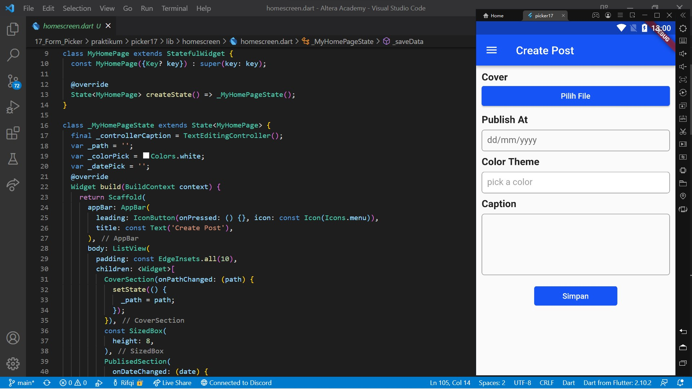
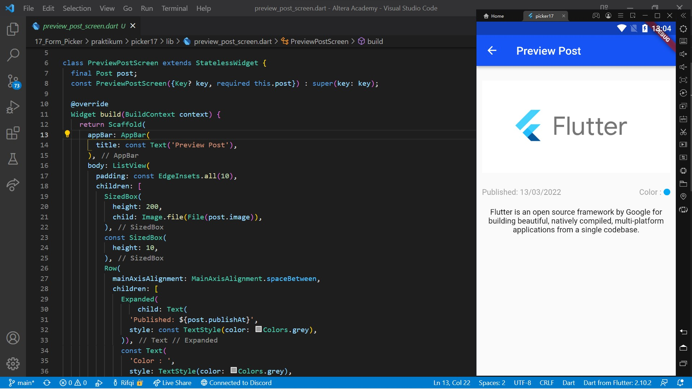
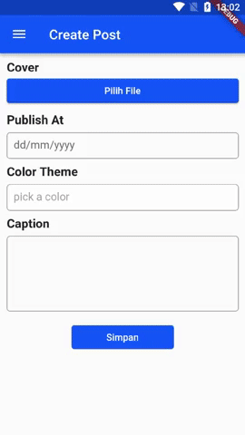

# 17. Form Picker

```
Name    : Rifqi Mufidianto 
Section : 17. Form Picker
Date    : Day 28
``` 

## Summary of Basic Layouting

### Row dan Column
- Row meletakkan widget children nya secara **horizontal**
- Column meletakkan widget children nya secara **vertikal**

### MainAxisSize
- Menentukan seberapa banyak space menempati main axis
- Main axis dari Row adalah horizontal
- Main axis dari Column adalah vertikal
- Properti mainAxisSize memiliki dua values yaitu, MainAxisSize.max dan MainAxisSize.min
- MainAxisSize.max menempati semua space dari main axis
- MainAxisSize.min tidak memiliki extra space, hanya untuk children nya saja

### MainAxisAlignment
- Properti ini digunakan Row dan Column untuk memposisikan children mereka di extra space yang ada
- Memiliki 6 values:
    - MainAxisAlignment.start
    - MainAxisAlignment.end
    - MainAxisAlignment.center
    - MainAxisAlignment.spaceBetween
    - MainAxisAlignment.spaceEvenly
    - MainAxisAlignment.spaceAround

### CrossAxisAlignment
- Properti ini digunakan Row dan Column untuk memposisikan children mereka pada cross axis
- CrossAxis dari Row adalah vertikal dan CrossAxis dari column adalah horizontal
- Memiliki 5 values:
    - CrossAxisAlignment.start
    - CrossAxisAlignment.end
    - CrosAxisAlignment.center
    - CrosAxisAlignment.stretch
    - CrosAxisAlignment.baseline

### Flexible Widget
- Membungkus widget lain sehingga child dari Flexible widget menjadi flexible atau resizable
- Sangat berguna untuk membuat aplikasi yang responsif
- **Harus berada dalam turunan parent widget Row atau Column**
- Perubahan ukuran ditentukan dengan properti fit dan flex
- Fit Properti
    - Menentukan apakah flexible widget memenuhi extra space yang tersedia di main axis nya
    - Menerima nilai value berupa FlexFit.loose atau FlexFit.tight
    - FlexFit.loose akan memiliki ukuran minimum     
    - FlexFit.tight akan memiliki ukuran maximum
- Flex properti
    - Menetukan perbandingan ukuran dari child widgetnya
    - Menerima nilai values berupa integer
    - Membandingkan nilainya dengan flex properti lain
        ```
        remaining space * (flex/totalOfAllFlexValues)
        ```

### Expanded Widget
- Membungkus widget lain sehingga ukuran dari child Expanded widget akan dipaksa untuk memenuhi ruang yang tersedia
- Sangat berguna untuk membuat aplikasi yang responsif
- **Harus berada dalam turunan parent widget Row atau Column**
- Memiliki default value FlexFit.tight
- Perubahan ukuran ditentukan dengan properti flex

## Summary of Advanced User Input
- Interaksi antara aplikasi dan user
- Mengumpulkan input dan feedback dari user

### Date Picker
- Widget dimana user bisa memasukkan tanggal seperti tanggal kelahiran, waktu pemesanan tiket, waktu reservasi restoran, jadwal meeting, dll.
- Cara membuat Date Picker
    - Menggunakan fungsi bawaan flutter *showDatePicker*
    - Fungsi *showDatePicker* memiliki tipe data future
    - Menampilkan dialog material design date picker
    - Menambahkan packages [intl](https://pub.dev/packages/intl) di *pubspec.yaml*
    - Menambahkan fungsi *showDatePicker* di dalam *onPressed*
    - Memanggil fungsi *setState* di dalam *onPressed*

### Color Picker
- Widget dimana user bisa memilih warna
- Penggunaan color picker bisa digunakan untuk berbagai macam kondisi
- Packages [flutter_colorpicker](https://pub.dev/packages/flutter_colorpicker) memiliki custom widget yang dapat digunakan, seperti `BlockPicker`, `ColorPicker`, dan `SlidePicker`
- Cara membuat Color Picker
    - Menggunakan packages [flutter_colorpicker](https://pub.dev/packages/flutter_colorpicker)
    - Mempersiapkan variabel yang dibutuhkan
    - Menambahkan fungsi *showDialog* didalam *onPressed* dengan return widget AlertDialog
    - Membuat kode untuk penggunaan packages tersebut.

### File Picker
- Kemampuan widget untuk mengkases storage
- Memilih dan membuka file
- Cara Membuat File Picker
    - Menggunakan packages [file_picker](https://pub.dev/packages/file_picker)
    - Membuat fungsi untuk meng-explore dan memilih files dari storage
    - Memanggil fungsi tersebut didalam onPressed
    - Mengambil file dari object result didalam fungsi yang telah dibuat          

## Task
Berikut hasil yang telah dicoba dan didapatkan pada materi ini.

[Project File](./praktikum/picker17/lib/)

### Task 01
[Source Code](./praktikum/picker17/lib/homescreen/)



### Task 02
[Source Code](./praktikum/picker17/lib/preview_post_screen.dart)




## Preview

