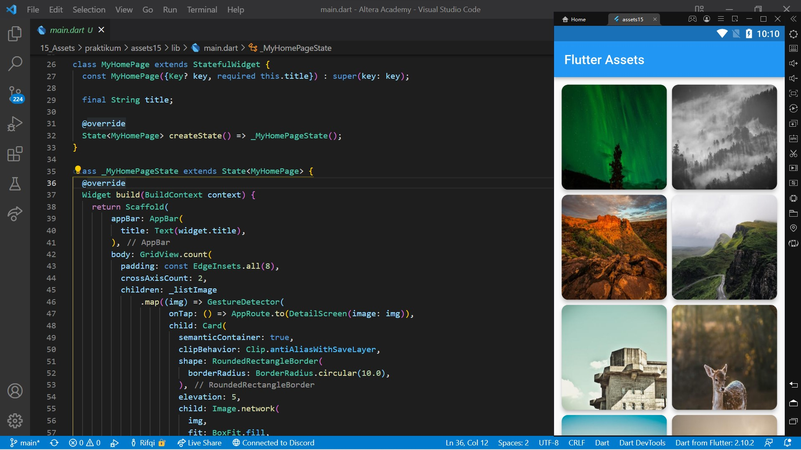
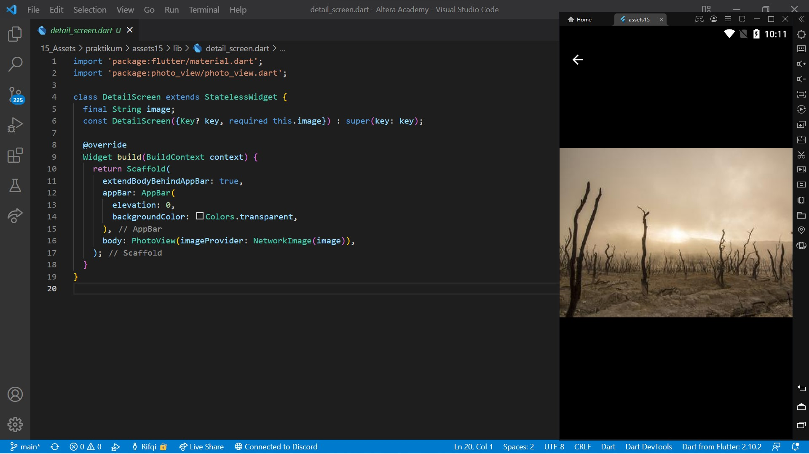

# 18. Assets

```
Name    : Rifqi Mufidianto 
Section : 18. Assets
Date    : Day 24 & 25
``` 

## Summary
### Assets
- File yang di bundled dan di deployed bersamaan dengan aplikasi
- Tipe-tipe assets, seperti: static data (JSON files), icons, images, dan font file (ttf)
- Menentukan Assets
    - Flutter menggunakan pubspec.yaml
    - Pubspec.yaml terletak pada root projectm untuk mengidentifikasi assets yang dibutuhkan aplikasi
    - Gunakan karakater `/` untuk memasukkan semua assets dibawah satu directory name

### Image
- Image atau gambar akan membuat tampilan aplikasi menjadi lebih menarik
- Flutter mendukung format gambar seperti JPEG, WebP, GIF, Animated Web/GIF, PNG, BMP, dan WBMP.
- Menampilkan gambar dari project assets dan internet.
- Untuk menampilkan Image
    - Gunakan widget Image
    - Membutuhkan properti image dengan nilai class AssetImage()
    - Menggunakan method Image.asset, mendapatkan image yang sudah ditambahkan dalam project
    - Menggunakan method Image.network, mendapatkan data image melalui internet dengan menggunakan string url nya

### Font
- Penggunaan font dengan style tertentu akan menjadi keunikan pada aplikasi
- Penetuan font yang mau dipakai biasanya oleh UI desainer
- Penerapan font menggunakan custom font atau dari package
- Untuk menggunakan custom font
    - Cari dan download font yang diinginkan
    - Import file `.ttf`
    - Daftarkan font di pubspec.yaml
    - Mengatur font sebagai default dengan menambahkan di ThemeData()
    - Gunakan font di spesifik widget
- Untuk menggunakan font dari package
    - Tambahkan package [google_fonts](https://pub.dev/packages/google_fonts) di dependencies
    - Import pacakage di file dart
    - Guanakan font dengan memanggil GoogleFonts.namaFont()


## Task
Berikut hasil yang telah dicoba dan didapatkan pada materi ini. Pada project ini digunakan library [photo_view](https://pub.dev/packages/photo_view) untuk men-zoom in atau zoom-out gambar.

[Project File](./praktikum/assets15/lib/)

### Task 01
[Source Code](./praktikum/assets15/lib/main.dart)



### Task 02
[Source Code](./praktikum/assets15/lib/detail_screen.dart)



## Preview

