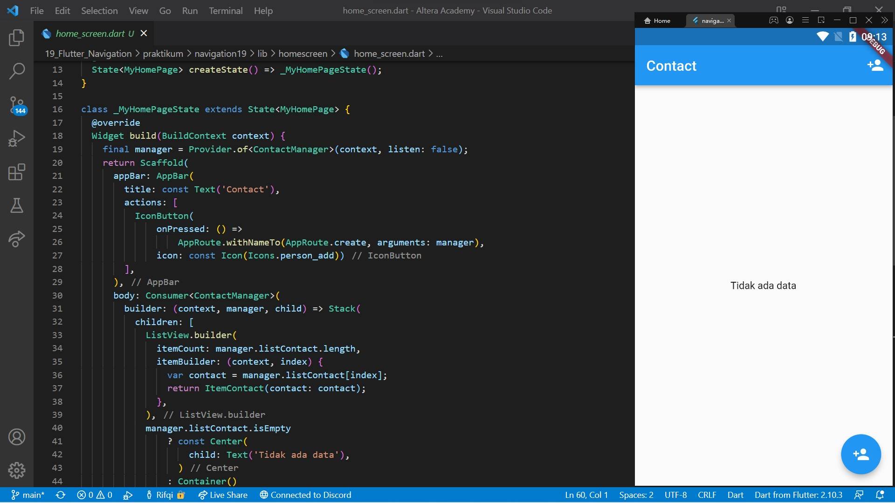
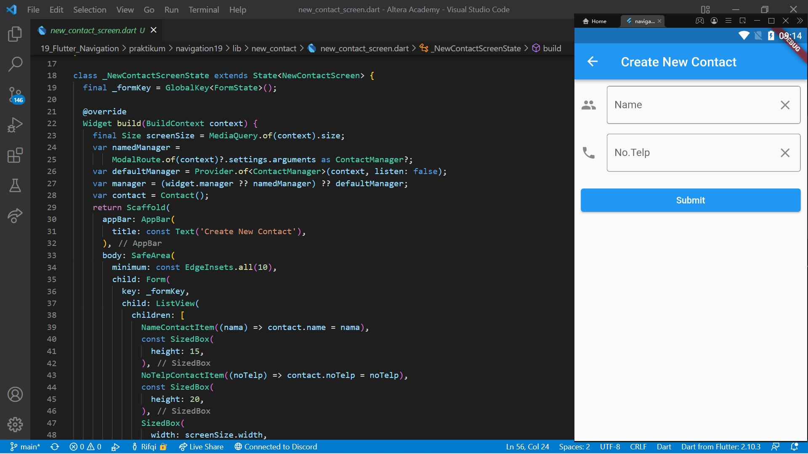
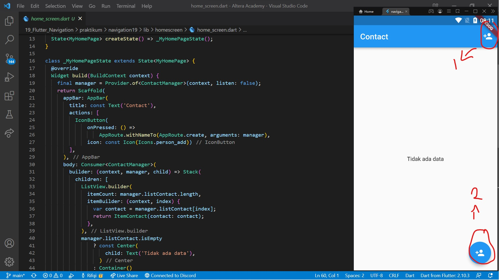
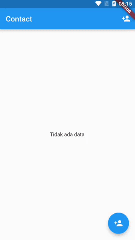

# 19. Flutter Navigation

```
Name    : Rifqi Mufidianto 
Section : 19. Flutter Navigation
Date    : Day 30
``` 

## Summary
### Apa itu Navigation?
- Berpindah dari halaman satu ke halaman lain

### Navigation Dasar
- Perpindahan halaman menggunakan `Navigator.push()`
- Kembali ke halaman sebelumnya menggunakan `Navigator.pop()`
- Untuk mengirim data ke halaman baru dapat menggunakan parameter pada constructor halaman

### Navigation dengan Named Routes
- Tiap halaman memiliki alamat yang disebut route
- Perpindahan halaman menggunakan `Navigator.pushNamed()`
- Kembali ke halaman sebelumnya menggunakan `Navigator.pop()`
- Terlebih dahulu mendaftarkan route dengan cara
    - Tambahkan *initialRoute* dan *routes* pada MaterialApp
    - Tiap route adalah fungsi adalah fungsi yang membentuk halaman
- Untuk mengirim data ke halaman baru dapat menggunakan arguments saat melakukan *pushNamed*. Untuk memanggil data tersebut yaitu denga cara
    ```
    final parameter = ModalRoute.of(context)?.settings.arguments as String;
    ```    

## Task
Berikut hasil yang telah dicoba dan didapatkan pada materi ini. Dengan bantuan library [provider](https://pub.dev/packages/provider) untuk mendapatkan update data.

### Source Code

[Project File](./praktikum/dialog18/lib/)

### Task 01

[Folder Task Home Screen 1](./praktikum/navigation19/lib/homescreen/)

[Folder Task New Contact 1](./praktikum/navigation19/lib/new_contact/)

[Source Code Home Screen](./praktikum/navigation19/lib/homescreen/home_screen.dart)

[Source Code New Contact](./praktikum/navigation19/lib/new_contact/new_contact_screen.dart)





### Task 02

[Source Code AppRoute](./praktikum/navigation19/lib/utils/app_route.dart)



Note
- Tombol 1 (Icon button) -> Navigasi dengan menggunakan Named Routes
- Tombol 2 (FAB) -> Navigasi dengan menggunakan tanpa Named Routes

### Preview




