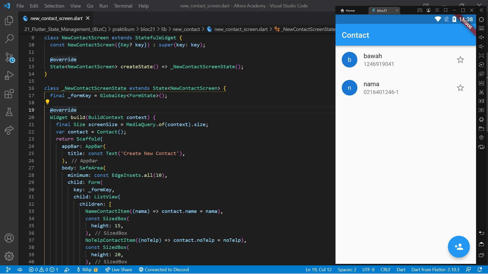

# 21. Flutter State Management (BLoC)

```
Name    : Rifqi Mufidianto 
Section : 21. Flutter State Management (BLoC)
Date    : Day 33 & 34
``` 

## Summary
### Declarative UI
- Flutter memiliki sifat declarative yang artinya flutter membangun UI nya pada screen untuk mencerminkan keadaan state saat ini
- State adalah ketika sebuah widget sedang aktif dan widget tersebut menyimpan data di memori
- Flutter akan membangun ulang UI nya ketika ada state atau data yang berubah
- Ada 2 jenis state dalam flutter, yaitu `ephemeral state` dan `app state`
- Pendekatan State Management
    - setState -> Lebih cocok penggunaan nya pada ephemeral state
    - Provider -> Penggunaan untuk state management yang lebih kompleks seperti app state, pendekatan ini direkomendasikan oleh tim flutter karena mudah dipelajari
    - BLoc -> Menggunakan pola stream/observable, untuk memisahkan UI dengan bisnis logic nya

#### Ephemeral State
- Digunakan ketika tidak ada bagian lain pada widget tree yang membutuhkan untuk mengakses data widgetnya, contohnya:
    - PageView
    - BottomNavigationBar
    - SwitchButton
- Tidak perlu state management yang kompleks
- Hanya membutuhkan **StatefulWidget** dengan menggunakan fungsi *setState()*

#### App State
- Digunakan ketika bagian yang lain suatu aplikasi membutuhkan akses ke data state widget, contohnya:
    - Login info
    - Pengaturan preferensi pengguna
    - Keranjang belanja, dimana informasi yang pengguna pilih di suatu screen yang mana informasi itu akan muncul di screen yang berbeda

### setState
- Menggunakan pendekatan state management dengan fungsi *setState()*

### Provider
- Menggunakan pendekatan state management dengan lib [Provider](https://pub.dev/packages/provider)
- Untuk lebih lengkapnya dapat dilihat [disini.](/20_Flutter_State_Management_(Provider)/summary.md)

### BLoc (Business Logic Component)
- Memisahkan antara business logic dengan UI
- Kenapa BLoc ?
    - Simple
    - Powerful
    - Testable
- Stream merupakan rangkaian proses secara asynchronous, actor utama di dalam BLoc    
- Cara kerja BLoc
    - Menerima event sebagai input
    - Dianalisa dan dikelola di dalam BLoc
    - Menghasilkan state sebagai output    

## Task
Berikut hasil yang telah dicoba dan didapatkan pada materi ini. Dengan bantuan library [flutter_bloc](https://pub.dev/packages/flutter_bloc) & [equatable](https://pub.dev/packages/equatable) untuk state management.

### Source Code

[Project File](./praktikum/provider20/lib/)

[Folder Bloc](./praktikum/bloc21/lib/bloc/)

[Folder HomeScreen](./praktikum/bloc21/lib/homescreen/)

[Folder New Contact](./praktikum/bloc21/lib/new_contact/)

### Task 01 (Untuk data Contact)

[Source Code ContactBloc](./praktikum/bloc21/lib/bloc/contact_bloc.dart)




### Task 02 (Untuk favorite Contact)

[Source Code ContactBloc](./praktikum/bloc21/lib/bloc/contact_favorite_bloc.dart)


### Screenshoots

