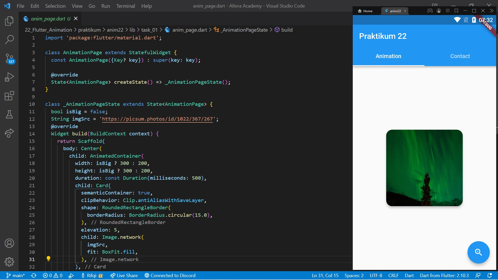
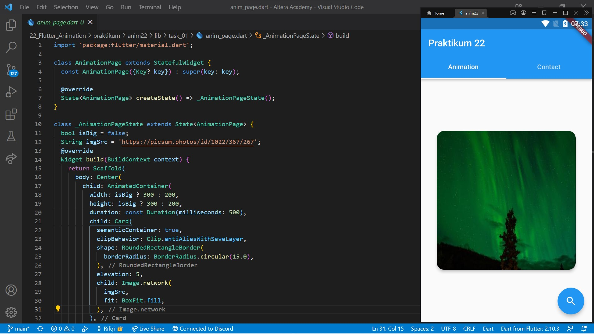
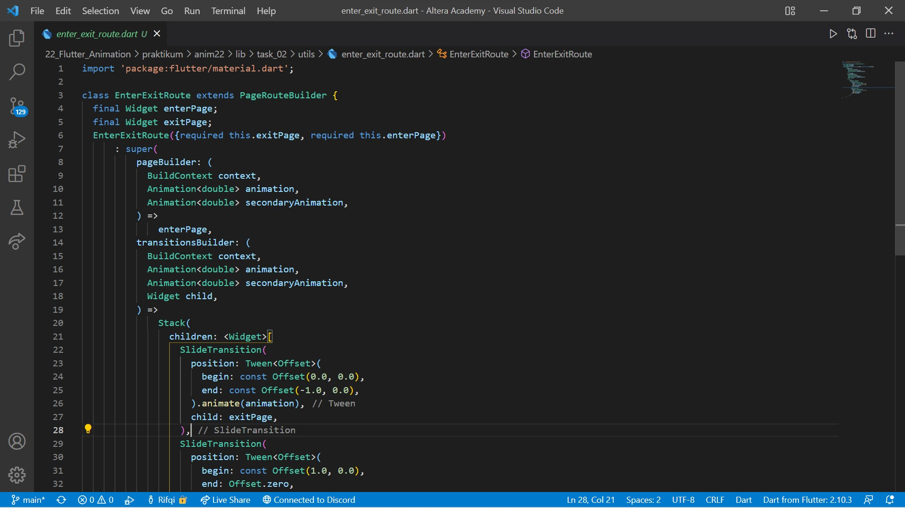
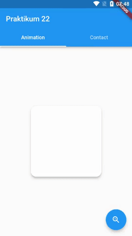

# 22. Flutter Animation

```
Name    : Rifqi Mufidianto 
Section : 22. Flutter Animation
Date    : Day 35
``` 

## Summary
### Animation
- Animasi membuat aplikasi terlihat hidup
- Widget yang bergerak menambah daya tarik
- Pergerakan dari kondisi A ke kondisi B

### Implicit Animation
- Versi animasi dari widget yang sudah ada

### Transition
- Animasi yang terjadi saat perpindahan halaman
- Dilakukan pada bagian `Navigator.push()`

### Transition Umum
- Fade Transition -> Halaman muncul dengan efek redup menuju ke tampak jelas secara penuh
- Scale Transition -> Halaman muncul dengan efek berubah ukuran dari tidak penuh menuju tampil keseluruhan

## Task
Berikut hasil yang telah dicoba dan didapatkan pada materi ini.

[Folder Task 01](./praktikum/anim22/lib/task_01/)

[Folder Task 02](./praktikum/anim22/lib/task_02/)

### Task 01

[Source Code](./praktikum/anim22/lib/task_01/anim_page.dart)





### Task 02

[Transition Source Code](./praktikum/anim22/lib/task_02/utils/enter_exit_route.dart)

[AppRoute Source Code](./praktikum/anim22/lib/task_02/utils/app_route.dart)



### Screenshoots

