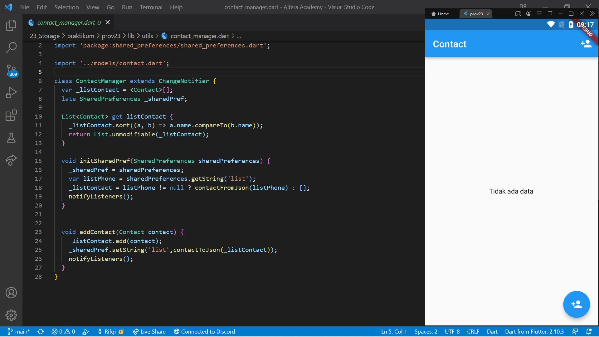
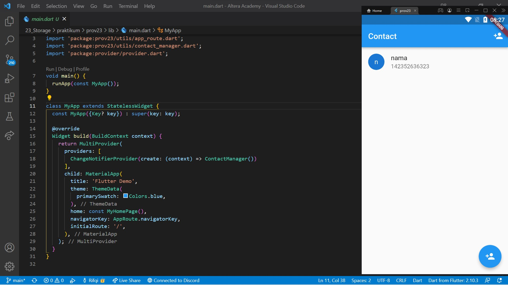
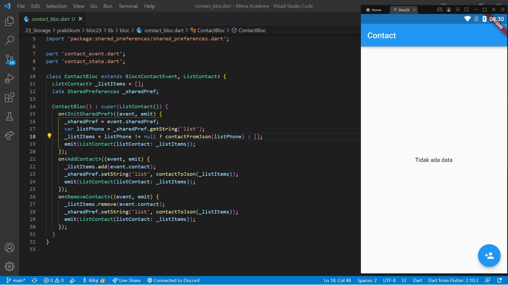
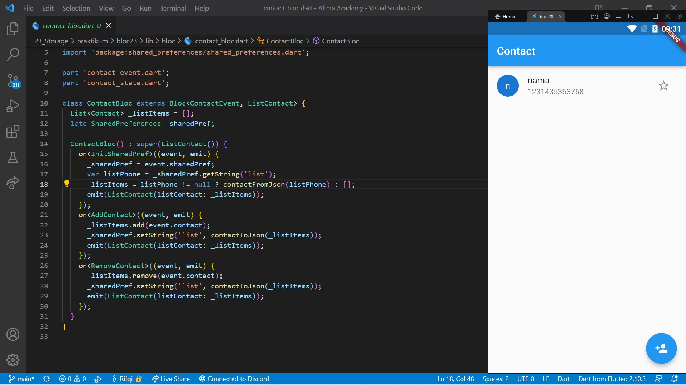

# 23. Stroage

```
Name    : Rifqi Mufidianto 
Section : 23. Stroage
Date    : Day 36 & 37
``` 

## Summary
### Penyimpanan Lokal
- Diperlukan untuk efisiensi pengguna data internet
- Ada beberapa cara implementasi penyimpanan lokal, contohnya seperti, `Shared Preferences` dan `Local Database`

### Shared Preferences
- Menyimpan data yang sederhana
- Penyimpanan dengan format key-value
- Menyimpan tipe data dasar seperti teks, angka, dan boolean.
- Contoh pengguna shared preference seperti menyimpan data login dan menyimpan riwayat pencarian
- Diprelukan pacakage [shared_preference](https://pub.dev/packages/shared_preferences)

### Local Database (SQLite)
- Menyimpan dan meminta data dalam jumlah besar pada local device
- Bersifat private
- Menggunakan SQLite database melalu package [sqflite](https://pub.dev/packages/sqflite)
- SQLite adalah database open source yang mendukung insert, read, update dan remove data

## Task
Berikut hasil yang telah dicoba dan didapatkan pada materi ini.

[Folder Task 01](./praktikum/prov23/lib/)

[Folder Task 02](./praktikum/bloc23/lib/)

### Task 01

[Source Code Shared Preferences](./praktikum/prov23/lib/utils/contact_manager.dart)





### Task 02

[Source Code Shared Preferences](./praktikum/bloc23/lib/bloc/contact_bloc.dart)



