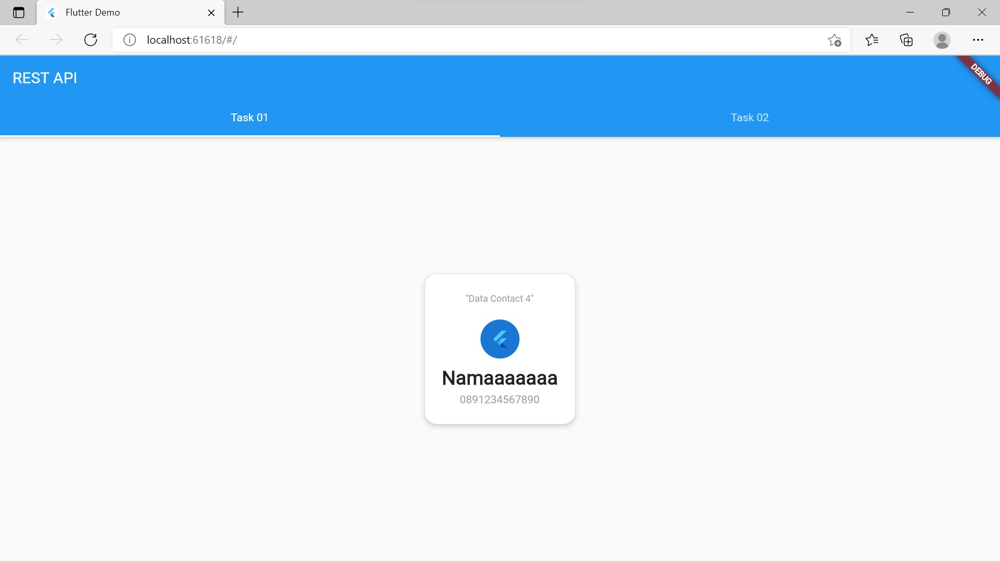
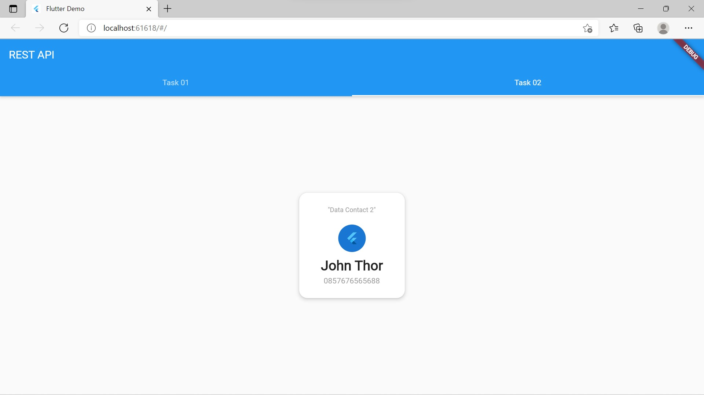

# 24. Introduction REST API - JSON serialization/deserialization

```
Name    : Rifqi Mufidianto 
Section : 24. Introduction REST API - JSON serialization/deserialization
Date    : Day 38 & 39
``` 

## Summary
### REST API
- Arsitektural yang memisahkan tampilan dengan proses bisnis
- Bagian tampilan dengan proses bisnis berkirim data melalui HTTP Request

### HTTP
- Protokol yang digunakan untuk berkirim data pada internet, biasanya data tersebut berbentuk media web
- Client mengirim request
- Server mengolah dan membalas dengan memberi response

#### Struktur Request
- URl
    - Alamat halaman yang akan diakses
- Method (GET, POST, PUT, DELETE)
    - Menunjukkan aksi yang diinginkan
- Header
    - Informasi tambahan terkait request yang dikirimkan
- Body
    - Data yang disertakan bersama request    

#### Struktur Response
- Status Code
    - Kode yang mewakili keseluruhan response, baik sukses maupun gagal
- Header
    - Informasi tambahan terkait response yang diberikan
- Body
    - Data yang disertakan bersama response                

### Dio
- Sebagai HTTP Client yang dimanfaatkan untuk melakukan REST API
- Diperlukan pacakage [dio](https://pub.dev/packages/dio)

### Serialisasi JSON
- Mengubah struktur data ke bentuk JSON
- Menggunakan `jsonEncode()` dari package **dart:convert**

### Deserialisasi JSON
- Mengubah bentuk JSON ke struktur data
- Menggunakan fungsi `jsonDecode()` dari package **dart:convert**


## Task
Berikut hasil yang telah dicoba dan didapatkan pada materi ini. Berhubung tidak ada parameter yang dibutuhkan ketika post maka task 1 hanya seperti gambar dibawah dengan bertambahnya id 4.

[Folder Project](./praktikum/dio24/lib/)

[Source Code Api Client](./praktikum/dio24/lib/data/api_client.dart)



