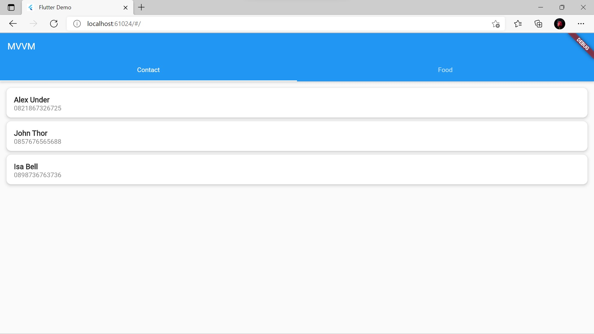
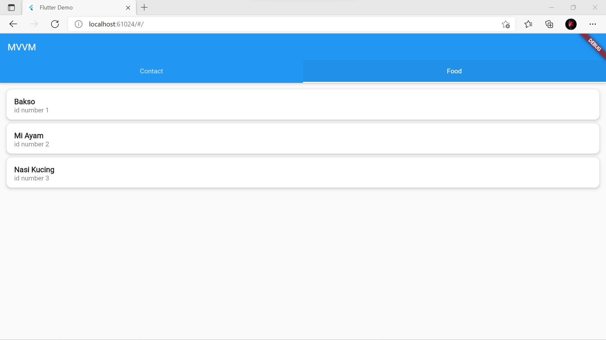

# 25. MVVM Architecture

```
Name    : Rifqi Mufidianto 
Section : 25. MVVM Architecture
Date    : Day 40 & 41
``` 

## Summary
### Apa itu MVVM Architecture?
- MVVM -> Model-View-ViewModel
- Memisahkan logic dengan tampilan (View) ke dalam ViewModel

### Keuntungan MVVM
- Reusability
    - Jika ada beberapa tampilan yang memerlukan alur logic yang sama, mereka bisa menggunakan ViewModel yang sama
- Maintainability
    - Mudah dirawat karena pekerjaan terkait tampilan tidak tertumpuk bersama logic
- Testability
     - Pengujian menjadi terpisah antara pengujian tampilan dengan pengujian logic sehingga dapat meningkatkan produktivitas pada pengujian         

### Melakukan MVVM

#### Struktur Direktori
- Model memiliki 2 bagian, yaitu bentuk data yang akan digunakan dan sumber dari data tersebut
- Tiap screen diletakkan dalam sebuah direktori yang didalamnya terdapat `View` dan `ViewModel`

#### Model
- Bentuk data yang akan digunakan, dibuat dalam bentuk class
- Data-data yang dimuat, diletakkan pada property

#### ViewModel
- Menyimpan data-data dan logic yang diperlukan halaman
- Jika widget lain memerlukan logic yang sama, dapat menggunakan ViewModel ini juga

#### View
- Menggunakan StatefulWidget

#### Mendaftarkan ViewModel
- Menggunakan `MultiProvider()` agar dapat menggunakan banyak ViewModel
- MaterialApp sebagai child utama

#### Menampilkan Data di View
- Letakkan pada bagian build
- Menggunakan getters yang ada pada ViewModel
- Data dapat langsung ditampilkan pada widgets

## Task
Berikut hasil yang telah dicoba dan didapatkan pada materi ini.

[Folder Project](./praktikum/mvvm25/lib/)

### Source Code MVVM

[Model](./praktikum/mvvm25/lib/models/)

[Api Client](./praktikum/mvvm25/lib/data/api_client.dart)

[View & ViewModel Contact](./praktikum/mvvm25/lib/screen/contact/)

[View & ViewModel Food](./praktikum/mvvm25/lib/screen/food/)

### Screenshots



