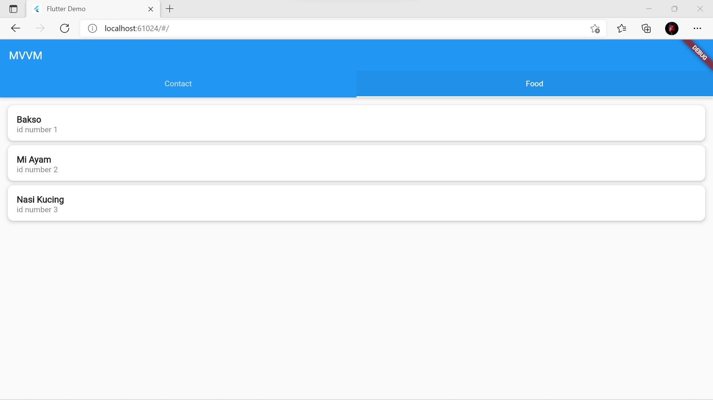
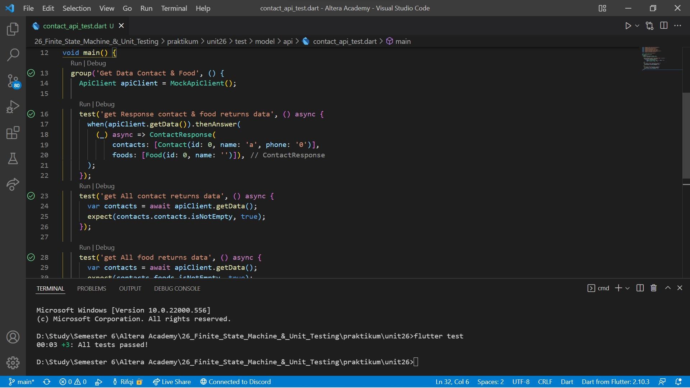

# 26. Finite State Machine & Unit Testing

```
Name    : Rifqi Mufidianto 
Section : 26. Finite State Machine & Unit Testing
Date    : Day 42 & 43
``` 

## Summary of Finite State Machine

### Finite State Machine
- Mesin yang memiliki sejumlah state
- Tiap state menunjukkan apa yang terjadi sebelumnya
- Terdapat 3 state yang menunjukkan kejadian dalam suatu proses
    - `IDDLE` -> saat tidak terjadi proses
    - `RUNNING` -> saat proses sedang berjalan
    - `ERROR` -> saat proses gagal diselesaikan
- Contoh Sukses
    - **IDDLE** berubah menjadi **RUNNING** saat proses berjalan
    - **RUNNING** kembali menjadi **IDDLE** saat proses selesai
- Contoh Gagal
    - **IDDLE** berubah menjadi **RUNNING** saat proses berjalan
    - **RUNNING** menjadi **ERROR** saat terjadi kegagalan
    - **ERROR** kembali menjadi **IDDLE**
- Menambah enum untuk masing-masing state:
    - none saat IDDLE
    - loading saat RUNNING
    - error saat ERROR            

### Widget with Finite State
- Informasi finite state dapat berguna untuk menetukan seperti apa tampilan yang dimunculkan
- Saat state menunjukkan **RUNNING**, maka ditampilkan progress indicator
- Saat state menunjukkan **IDDLE** setelah RUNNING, maka ditampilkan data yang didapatkan
- Saat state menunjukkan **ERROR**, maka ditampilkan pesan yang menunjukkan bahwa proses tidak dapat diselesaikan

## Summary Unit Testing

### Unit Test
- Salah satu jenis pengujian pada perangkat lunak
- Pengujian dilakukan pada unit dalam perangkat lunak
- Unit yang dimaksud umumnya adalah fungsi atau method
- Tujuan Unit Test
    - Memastikan fungsi dapat mengolah berbagai jenis input
    - Memastikan hasil dari suatu fungsi atau method sudah sesuai
    - Menjadi dokumentasi
- Bagaimana melakukan unit test
    - **Manual** -> Unit dijalankan dan dicek hasilnya secara manual
    - **Automated** -> Menulis script yang dapat dijalankan berkali-kali menggunakan test runner
- Dibutuhkan package [test](https://pub.dev/packages/test), pada bagian `dev_dependencies` dalam file **pubspec.yaml**
- Pada folder **test**, tambahkan folder baru **model/api**. Contohnya **contact_api_test.dart**
- Mengelompokkan test dengan beberapa subjek test dengan subjek yang sama diletakkan dalam sebuah kelompok yang dilakukan dengan menggunakan group

### Mocking
- Proses yang terikat dengan sistem eksternal dapat mempengaruhi berjalannya pengujian
- Pengaruh tersebut dapat mengganggu proses pengujian
- Dilakukan mocking untuk menghindari masalah-masalah tersebut

#### Cara kerja Mocking
- Suatu object dibuat bentuk tiruannya
- Bentuk tiruan tersebut memiliki input dan outpu yang sama dengan yang asli
- Bentuk tiuran menghilangkan ketergantungan pada sistem eksternal
- Tambahkan package [mockito](https://pub.dev/packages/mockito) dan [build_runner](https://pub.dev/packages/build_runner) pada bagian **dev_dependencies** dalam file pubspec.yaml
- Memasang annotation untuk membuat mock
- Membuat file mock dengan menjalankan perintah `flutter pub run build_runner build`

## Task
Berikut hasil yang telah dicoba dan didapatkan pada materi ini.

[Folder Project](./praktikum/unit26/lib)

[Folder Test Project](./praktikum/unit26/test/model/api/)

### Source Code MVVM

[Model](./praktikum/unit26/lib/models)

[Api Client](./praktikum/unit26/lib/data/api_client.dart)

[View & ViewModel Contact](./praktikum/unit26/lib/screen/contact/)

[View & ViewModel Food](./praktikum/unit26/lib/screen/food/)

### Task 01

[Source Code Food Screen](./praktikum/unit26/lib/screen/food/food_page.dart)

[Source Code Food ViewModel](./praktikum/unit26/lib/screen/food/food_viewmodel.dart)



### Task 02

[Source Code Test API](./praktikum/unit26/test/model/api/contact_api_test.dart)

