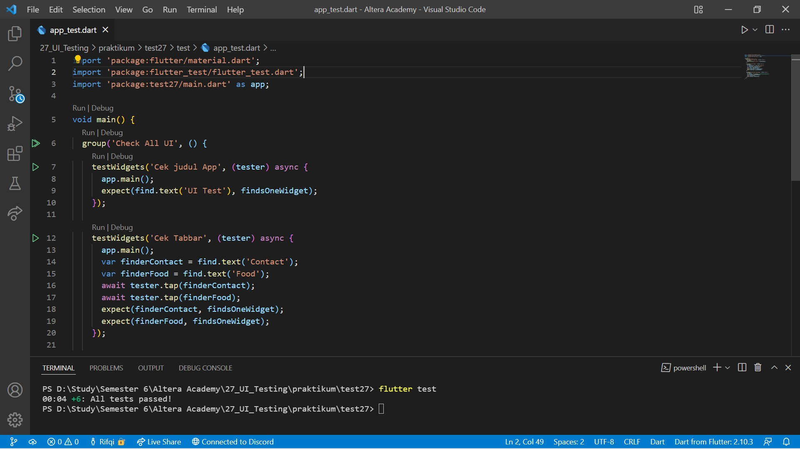

# 27. UI Testing

```
Name    : Rifqi Mufidianto 
Section : 27. UI Testing
Date    : Day 44 & 45
``` 

## Summary

### Tentang UI Testing
- Merupakan **pengujian** yang dilakukan **pada tampilan** suatu aplikasi untuk memastikan aplikasi dapat menerima interaksi dan memberi respon kepada pengguna
- Disebut juga widget testing sehingga pengujian dilakukan pada widgets dengan menuliskan script yang dapat dijalankan secara otomatis.

### Keuntungan UI Testing
- Memastikan seluruh widget memberi tampilan yang sesuai
- Memastikan seluruh interaksi dapat diterima dengan baik
- Menjadi ketentuan yang harus diikuti saat diperlukan perubahan pada widget

### Melakukan UI Testing
- Pada umumnya, package testing sudah ter-install sejak project pertama dibuat. Tetapi, cara ini dapat dilakukan, jika ingin meng-install secara manual
- Dilakukan pada folder `test`
- Nama file harus diikuti dengan `[nama file]_test.dart`. Contohnya contact_test.dart
- Tiap file berisi fungsi **main()** yang di dalamnya dapat dituliskan script testing
- Tiap skenario pengujian disebut **test case**
- Script Testing
    - Test case diawali dengan **testWidgets()** dan diberi judul
    - Simulasi proses mengaktifkan sebuah halaman yang ingin di uji dengan `tester.pumpWidget()`
    - Memeriksa apakah di halaman tersebut terdapat apa yang ingin kita uji
- Menjalankan Testing
    - Perintah `flutter test` akan menjalankan seluruh file test yang dibuat
    - Hasil dari perintah ini adalah lamanya waktu pengujian, total pengujian, dan pesan bahwa pengujian berhasil
    - Dan ketika hasil testing gagal maka akan ditampilkan penyebab gagalnya pengujian     

## Task
Berikut hasil yang telah dicoba dan didapatkan pada materi ini.

### Source Code MVVM

[Model](./praktikum/test27/lib/models/)

[Api Client](./praktikum/test27/lib/data/api_client.dart)

[View & ViewModel Contact](./praktikum/test27/lib/screen/contact/)

[View & ViewModel Food](./praktikum/test27/lib/screen/food/)

### Task 01

[Source Code UI Test](./praktikum/test27/test/app_test.dart)

