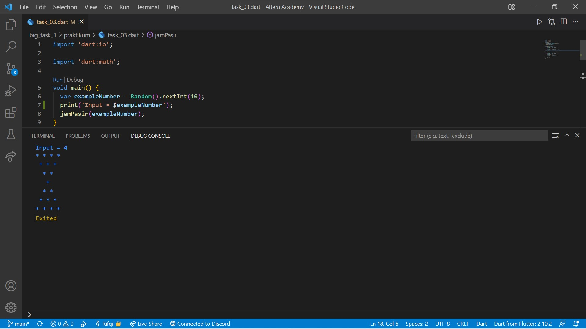
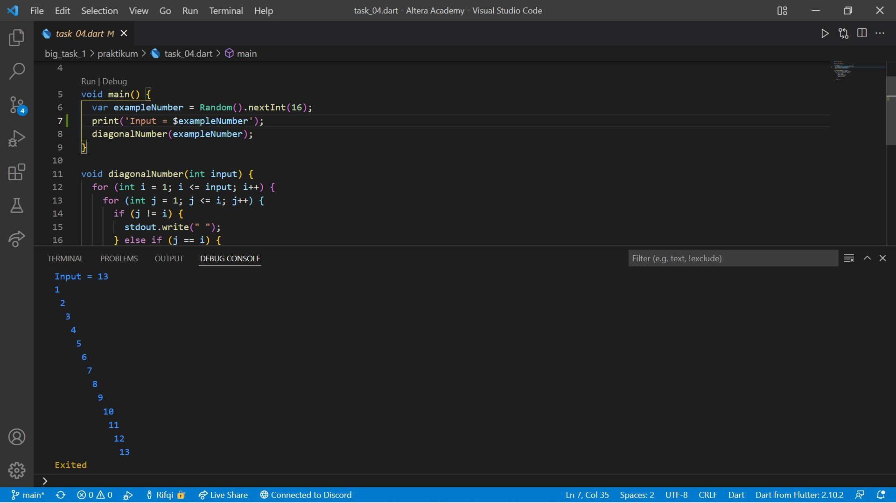

# Big Task 1 for Basic Dart Programming

```
Name    : Rifqi Mufidianto 
Section : Big Task 1 for Basic Dart Programming
Date    : 5 March 2022
``` 

## Summary
Ini merupakan Tugas besar dari beberapa materi atau section.

## Task
Untuk mendapatkan inputan, disini menggunakan random angka (lib 'dart:math'). Berikut hasil yang telah dicoba dan didapatkan pada materi ini.

### List Source Code
- [Ganjil - Genap](./praktikum/task_01.dart)
- [Azimuth/Back-Azimuth](./praktikum/task_02.dart)
- [Jam Pasir](./praktikum/task_03.dart)
- [Diagonal Angka](./praktikum/task_04.dart)

### Problem 1 - Ganjil - Genap
[Source Code](./praktikum/task_01.dart)

**Contoh dari Ganjil** 


**Contoh dari Genap** 


### Problem 2 - Azimuth/Back-Azimuth
[Source Code](./praktikum/task_02.dart)

**Screenshoots Tugas 2** 


### Problem 3 - Jam Pasir
[Source Code](./praktikum/task_03.dart)

**Screenshoots Tugas 3** 




### Problem 4 - Diagonal Angka
[Source Code](./praktikum/task_04.dart)

**Screenshoots Tugas 4** 


